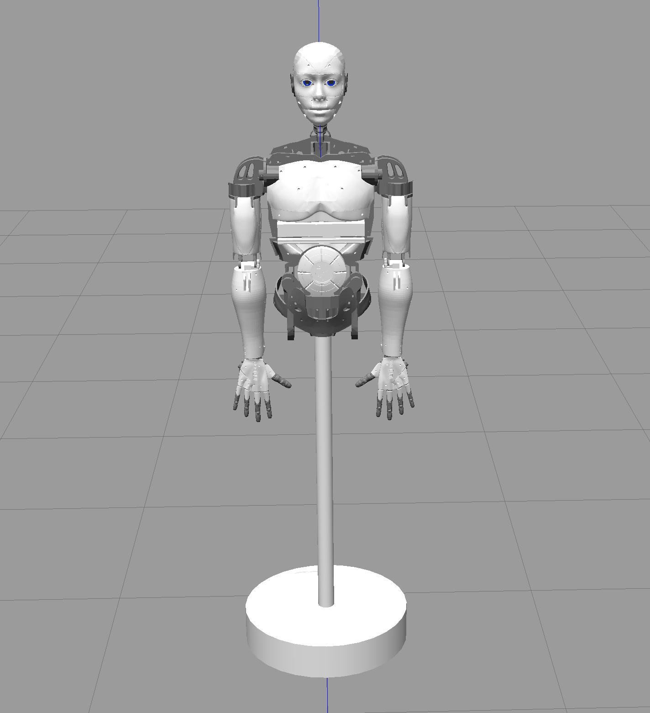

# Getting started

The robot uses ROS (Robot Operating System). Read the [ROS wiki!](http://wiki.ros.org/).

## What is ROS? ([From the wiki](http://wiki.ros.org/ROS/Introduction))

ROS is an open-source, meta-operating system for your robot. It provides the services you would expect from an operating system, including hardware abstraction, low-level device control, implementation of commonly-used functionality, message-passing between processes, and package management. It also provides tools and libraries for obtaining, building, writing, and running code across multiple computers. ROS is similar in some respects to 'robot frameworks,' such as Player, YARP, Orocos, CARMEN, Orca, MOOS, and Microsoft Robotics Studio.

The ROS runtime "graph" is a peer-to-peer network of processes (potentially distributed across machines) that are loosely coupled using the ROS communication infrastructure. ROS implements several different styles of communication, including synchronous RPC-style communication over services, asynchronous streaming of data over topics, and storage of data on a Parameter Server. These are explained in greater detail in our Conceptual Overview.

## Setup

TODO: add VM download link

VM username & password: ros

The VM comes with ROS melodic and [MoveIt](https://moveit.ros.org/) motion planning framework pre-installed.

Verify that `$WORKSPACE` defined in `.bashrc`
is set to the workspace directory.

Remember to `source ./devel/setup.sh` after `catkin_make` (`build.sh` does this)

## Project structure

* /src - all packages (3rd party and ours)
* /PMU2D2 - Arduino controller (just forwards data) for Dynamixel servos (is not 100% reliable)
* /config - Configuration files for servos, camera, etc

## Servos

Dynamixel ROS instructions are [here](http://emanual.robotis.com/docs/en/software/dynamixel/dynamixel_workbench/).

How to find connected dynamixel servos (serial port could be different for you):

```sh
$ rosrun dynamixel_workbench_controllers find_dynamixel /dev/ttyACM0
[ INFO] [1578781097.059273105]: Succeed to init(9600)
[ INFO] [1578781097.059380826]: Wait for scanning...
[ INFO] [1578781118.899728953]: Find 1 Dynamixels
[ INFO] [1578781118.899810859]: id : 1, model name : XL-320
[ INFO] [1578781118.903439606]: Succeed to init(57600)
```

```sh
roslaunch dynamixel-test.launch
```

Commands can be send to servos using rqt when testing:


Address names are in `Camel_Case`.
Check the [dynamixel_item.cpp](https://github.com/ROBOTIS-GIT/dynamixel-workbench/blob/master/dynamixel_workbench_toolbox/src/dynamixel_workbench_toolbox/dynamixel_item.cpp) for full list of address names.

Note that servo communication packet timeout values were increased in [protocol2_packet_handler.cpp](src/DynamixelSDK/ros/src/dynamixel_sdk/protocol2_packet_handler.cpp)
to suit the Arduino. If you run into servo communication problems (such as `There is no status packet!`) you may want to change those.

Now that we have verified that the servo can be controlled,
let's move to configuring and testing joints.

Joint communication happens using topics.

By default, dynamixel_workbench
publishes following topics:

```sh
$ rostopic list
/dynamixel_workbench/dynamixel_state
/dynamixel_workbench/joint_states
/dynamixel_workbench/joint_trajectory
```

The type of the topic can be seen as follows:
```sh
$ rostopic type /dynamixel_workbench/joint_trajectory
trajectory_msgs/JointTrajectory
```

The message structure can be seen using `rowmsg show` command:
```sh
$ rosmsg show trajectory_msgs/JointTrajectory
std_msgs/Header header
  uint32 seq
  time stamp
  string frame_id
string[] joint_names
trajectory_msgs/JointTrajectoryPoint[] points
  float64[] positions
  float64[] velocities
  float64[] accelerations
  float64[] effort
  duration time_from_start
```

Example joint config:

```yaml
head_pan_joint:
  ID: 1 # servo id
  Return_Delay_Time: 0
```

If the joint was configured correctly it should move to position 1
when publishing the following message:

```sh
rostopic pub -1 /dynamixel_workbench/joint_trajectory trajectory_msgs/JointTrajectory -- '{header: auto, joint_names: ["head_pan_joint"], points: [{positions: [1], velocities: [1], accelerations: [1], effort: [1], time_from_start: 0}]}'
```

Read more about the YAML command line:
http://wiki.ros.org/ROS/YAMLCommandLine

## MoveIt!


https://moveit.ros.org/documentation/concepts/

Currently, only has planning group for the head.

You can edit the moveit config package as shown here:
http://docs.ros.org/melodic/api/moveit_tutorials/html/doc/setup_assistant/setup_assistant_tutorial.html

The moveit config is in `src/moveit_config`.

### Simulation



#### rviz

Launch in rviz:
```
roslaunch moveit_config demo.launch
```

rviz tutorial: http://docs.ros.org/kinetic/api/moveit_tutorials/html/doc/quickstart_in_rviz/quickstart_in_rviz_tutorial.html


#### Gazebo

Launch empty gazebo world:

```sh
roslaunch gazebo_ros empty_world.launch paused:=true use_sim_time:=false gui:=true throttled:=false recording:=false debug:=true
```

Add robot to the world:

```sh
rosrun gazebo_ros spawn_model -file $WORKSPACE/src/inmoov_description/urdf/inmoov-moveit-gazebo.urdf -urdf -x 0 -y 0 -z 1 -model inmoov
```

## Joint controllers

TODO: Implement action services for joint trajectory controllers:
http://docs.ros.org/melodic/api/moveit_tutorials/html/doc/controller_configuration/controller_configuration_tutorial.html

http://wiki.ros.org/ros_control