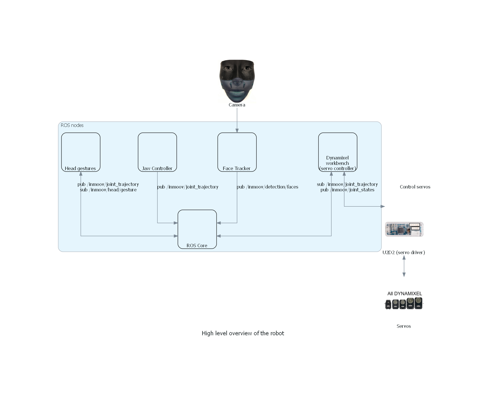

# Getting started

The robot uses ROS2 (Robot Operating System 2). Read the [ROS2 wiki!](https://index.ros.org/doc/ros2/).

**Note: See [development](./docs/DEVELOPMENT.md) for how to create VirtualBox ROS2 Foxy VM using Vagrant**

## The Robot

The robot uses dynamixel servos. Servos are controlled via the `robot_hardware` ROS node, which implements the hardware interface for [ros2_control](https://github.com/ros-controls/ros2_control). `robot` package contains the servo controller configurations
for the robot. See [head.yaml](src/robot/controllers/head.yaml), for example. The head supports `joint_trajectory_controller`. When using this controller, joints can be controlled by sending action messages to the trajectroy controller. See [bring up](./docs/BRINGUP.md) for an example.

Joint -> Servo mappings are defined in [config/dynamixel.yaml](./config/dynamixel.yaml).

<!--
See the diagram below and the servo joint configuration: [config/dynamixel.yaml](./config/dynamixel.yaml)

-->

## Project structure

* src - all packages
  * src/inmoov_description - robot files (URDF, SRDF & rviz configuration)
  * src/robot - robot launch files & servo controller configurations
  * src/robot_hardware - hardware interface for ros2_controller, communicates with U2D2 via dynamixel workbench
* config - servo configuration

## Servo Table

Baud rate: 57600

**Note: Servos can be configured using dynamixel wizard**

| Servo ID | Model | Joint name                  | Description           |
| -------- | ----- | --------------------------- | --------------------- |
| 1        | XL430 | head_tilt_right_joint       | Head tilt right-side  |
| 2        | XL430 | head_tilt_vertical_joint    | Head tilt up/down     |
| 3        | XL430 | head_tilt_left_joint        | Head tilt left-side   |
| 4        | XL430 | head_pan_joint              | Head turn left/right  |
| 10       | XL320 | eyes_shift_horizontal_joint | Eyes shift left/right |
| 11       | XL320 | eyes_shift_vertical_joint   | Eyes shift up/down    |
| 12       | XL320 | head_jaw_joint              | Open/close jaw        |

**Note: head tilt range of motion is poor**

**Note: servo angle limits are not configured**

## Getting started

1. See [Development](./docs/DEVELOPMENT.md)
2. See [Robot bring-up](./docs/BRINGUP.md)

**Note: Be careful not to move joints too much, limits are not set yet**