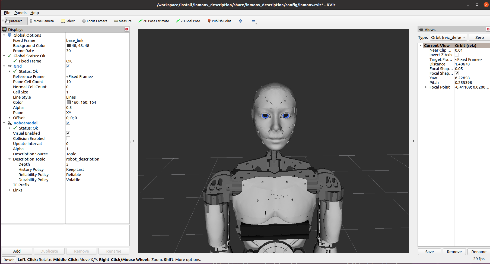

**Note: Remember to `colcon build` and `source install/setup.bash` first.**

## Bring-up fake (simulated) robot

The fake robot can be visualized using rviz. Run the following in a GUI environment:

```console
ros2 launch robot robot.fake.launch.py
```

This setups fake servo controllers and joint state publishers, and the following window should popup:



**Note: currently, only jaw, eyes & head pan movement can be simulated**

**Todo: Add support for other joints**

## Bring-up real robot

**Note moveit2 conflicts with ros2_controller, remove moveit2 workspace source commands from the .bashrc to fix this for now**

```console
ros2 launch robot robot.launch.py
```

```console
ros2 control load_start_controller joint_state_controller
ros2 control load_configure_controller head_controller
```

Check if controllers were loaded:

```console
ros2 control list_controllers
```

Start controllers:

```console
ros2 control switch_controllers --start-controllers head_controller
```

Confirm that all controllers are in `active` state:

```console
ros2 control list_controllers
```

To echo joint states into the console:

```console
ros2 topic echo /joint_states
```

**Todo: simplify bring up process (add commands to launch file)**

## Test servo control

If the bring-up succeeded, the following actions and topics should be available:

```console
vagrant@vagrant-ros:/workspace$ ros2 action list
/head_controller/follow_joint_trajectory

vagrant@vagrant-ros:/workspace$ ros2 topic list
/head_controller/joint_trajectory
/joint_states
```

For instance, if the joint `head_pan_joint` was configured correctly, it should move to position `0.5`
when publishing the following action (you are required to send positions for all joints):

```console
ros2 action send_goal /head_controller/follow_joint_trajectory control_msgs/action/FollowJointTrajectory "{
  trajectory: {
    joint_names: [head_pan_joint, head_tilt_right_joint, head_tilt_left_joint, head_tilt_vertical_joint],
    points: [
      { positions: [0.5, 0.0, 0.0, 0.0], time_from_start: { sec: 1, nanosec: 0 } }
    ]
  }
}"
```

`time_from_start` is the duration of the movement.

**Note: acceleration and velocity is fixed for real servos currently, so these cannot be controlled. This would require adding velocity and acceleration command interfaces to the JointTrajectoryAction controller**

<!--
## MoveIt!


https://moveit.ros.org/documentation/concepts/
-->
