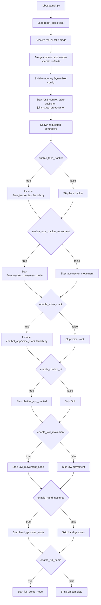
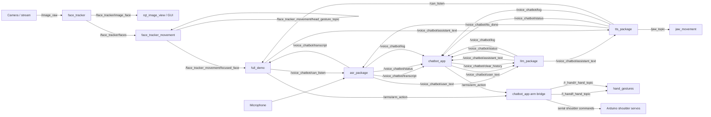

# Robot Bring-Up

The project is brought up through one package and two launch files:

- `ros2 launch robot robot.launch.py`
- `ros2 launch robot robot.fake.launch.py`

Equivalent wrappers:

- `pixi run launch-robot`
- `pixi run launch-robot-fake`
- `bash tools/launch_robot.sh`
- `bash tools/launch_robot_fake.sh`

## Stack Config

The canonical launch files read `config/robot_stack.yaml`.

That file controls:

- which robot parts are enabled
- which controllers are spawned in fake vs real mode
- whether RViz starts
- whether face tracking, face tracking movement, the voice stack, the GUI,
  full-demo, hand gestures, and jaw movement are included
- which voice config file is passed to the split voice stack

The root config is merged with fallback defaults from
`src/sop_robot_bringup/robot/config/robot_stack.defaults.yaml`.

## Launch Arguments

The main runtime arguments are:

- `stack_config_path`: override the root stack config YAML
- `robot_parts`: choose `head`, `arm`, or `all`
- `enabled_controllers`: comma-separated controllers to spawn
- `use_fake_hardware`: real launch only; fake launch forces this to `true`
- `use_rviz`: enable standalone RViz from the robot launch. Keep this false when using the unified UI RViz panel.
- `camera_source`: webcam index or stream URL
- `face_tracker_max_processing_fps`: cap face tracker analysis FPS; `0` means unlimited
- `face_tracker_processing_width`: downscale width for face analysis; `0` means original size
- `face_image_publish_every_n_frames`: publish annotated face image every nth processed frame
- `face_recognition_model`: DeepFace model used for identity embeddings
- `face_detection_model`: detector backend; `yunet` uses direct OpenCV FaceDetectorYN
- `face_tracker_prefer_gpu`: use the optional PyTorch/YOLO detector instead of OpenCV YuNet
- `gpu_face_recognition_model`: recognition model used when GPU recognition is selected
- `gpu_face_detection_model`: optional GPU detector model; `yolov8n` uses local `yolov8n-face.pt`
- `face_detection_confidence`: minimum confidence for face detections
- `face_detection_imgsz`: optional YOLO detector inference image size; lower is faster
- `no_face_detection_interval_frames`: when no face is present, run detector only every nth processed frame; `1` disables this
- `no_face_detection_warmup_frames`: detector frames to run before entering no-face scan mode
- `face_correlation_tracking`: use dlib correlation tracking between detector passes
- `face_detection_interval_frames`: run heavy face detection every nth processed frame
- `face_tracker_async_processing`: process only the latest camera frame on a worker thread
- `face_tracker_slow_frame_warning_seconds`: log slow tracker passes over this duration
- `face_image_max_width`: maximum width for the annotated debug image topic; `0` means original size
- `identity_store_max_identities`: maximum anonymous in-memory face identities for one run
- `identity_store_ttl_seconds`: expire unseen in-memory identities after this many seconds
- `webcam_width`: published webcam frame width; `0` means source/default width
- `webcam_height`: published webcam frame height; `0` means source/default height
- `webcam_fps`: requested webcam FPS and publish timer rate; `0` means default
- `webcam_capture_buffer_size`: requested OpenCV capture buffer size
- `webcam_read_warning_seconds`: log slow camera reads over this duration
- `webcam_reconnect_cooldown_seconds`: minimum seconds between camera reconnect attempts
- `webcam_status_log_interval_seconds`: log measured webcam publish FPS at this interval
- `webcam_low_latency_stream`: request low-latency OpenCV/FFmpeg network stream options
- `webcam_async_capture`: continuously drain the camera source into a latest-frame buffer
- `enable_face_tracker`
- `enable_face_tracker_movement`
- `enable_voice_stack`
- `enable_chatbot_ui`
- `enable_full_demo`
- `enable_hand_gestures`
- `enable_jaw_movement`
- `face_tracker_functionality`: `full`, `head`, or `eyes`
- `voice_config_path`
- `load_voice_config`
- `runtime_log_level`: default ROS log level for runtime nodes; `warn` keeps repetitive INFO status and controller action logs out of the terminal

## Voice Config

The robot launch files pass `voice_config_path` to the split voice stack. Runtime
ASR, LLM, retrieval, and TTS settings live in `config/voice_chatbot.json`:

- `whisper_backend`: ASR backend, either `faster-whisper`, `pywhispercpp`, or `crispasr`
- `whisper_cpp_model_filename` and `whisper_cpp_model_path`: local GGML Whisper model settings
- `crispasr_python_path`, `crispasr_lib_path`, `crispasr_model_path`, and `crispasr_backend`: CrispASR binding/model settings
- `llm_backend`: LLM backend, currently `llama-cpp`
- `llm_knowledge_base_enabled`: enable SQLite retrieval from `legacy/chatbot/chatbot/data`
- `llm_knowledge_base_path`: generated local SQLite database path
- `llm_knowledge_base_direct_answer`: allow answer arbitration to return the local SQLite answer when it is closer than the generated answer
- `tts_enabled` and `tts_gpu`: TTS runtime controls

Use `pixi run install-crispasr`, `pixi run install-whispercpp-cuda`, and
`pixi run install-llama-cuda` to prepare the optional CUDA-backed voice runtimes.

## DroidCam USB

The default `config/robot_stack.yaml` camera source is now the USB-forwarded
DroidCam endpoint:

```yaml
camera_source: "http://127.0.0.1:4747/video"
```

Before launching the robot, connect the phone over USB, start DroidCam on the
phone, enable USB debugging, then run:

```console
pixi run droidcam-usb
```

The helper uses `adb forward tcp:4747 tcp:4747`, so the ROS camera node reads
DroidCam through localhost instead of Wi-Fi. If `adb` cannot see the phone from
WSL, attach it from Windows PowerShell with `usbipd` first:

```powershell
usbipd list
usbipd bind --busid <BUSID>
usbipd attach --wsl --busid <BUSID>
```

DroidCam's phone app should be set to `Target FPS: 30 FPS` with `Minimum FPS:
Match Target`. Keep `webcam_fps: 30` in `config/robot_stack.yaml` to match that
setting and avoid blocked reads or uneven frame pacing.

## CPU Affinity

- `ros2_control_cpu_cores`: `taskset` CPU list for `ros2_control_node`
- `rviz_cpu_cores`: `taskset` CPU list for `rviz2`
- `face_tracker_cpu_cores`: `taskset` CPU list for `face_tracker_node`
- `webcam_cpu_cores`: `taskset` CPU list for `webcam_node`
- `asr_cpu_cores`: `taskset` CPU list for `asr_node`
- `llm_cpu_cores`: `taskset` CPU list for `llm_node`
- `tts_cpu_cores`: `taskset` CPU list for `tts_node`

CPU affinity values use Linux CPU-list syntax such as `4`, `2,3`, or `2-5`.
The root `config/robot_stack.yaml` may set defaults under `common.cpu_affinity`,
and each launch argument can override the config value.

The live camera topics use best-effort, depth-1 QoS so the UI and tracker drop
stale frames instead of displaying them late.
The unified UI renders camera topics on a fixed timer and samples only the newest
image. Keep `face_image_publish_fps: 0` unless you explicitly want to cap the
debug image ROS topic.

When `enable_chatbot_ui` is true, keep `use_rviz: false` in the stack config and
start RViz from the UI toolbar. The UI also tries to embed an existing RViz
window if one is already open.

The default face detector is OpenCV YuNet through `FaceDetectorYN`, with SFace
kept for identity embeddings. The current Pixi OpenCV build reports zero CUDA
devices through `cv2.cuda.getCudaEnabledDeviceCount()`, so OpenCV CUDA is not
active in the default environment. If OpenCV is rebuilt with CUDA DNN support,
the YuNet detector code automatically requests the OpenCV CUDA DNN backend.

Example:

```bash
ros2 launch robot robot.launch.py face_tracker_cpu_cores:=2,3 llm_cpu_cores:=6,7
```

Use `--show-args` to inspect the current descriptions directly from the launch files:

```bash
ros2 launch robot robot.launch.py --show-args
ros2 launch robot robot.fake.launch.py --show-args
```

## Runtime Control Flow


```mermaid
flowchart TD
  A[robot.launch.py] --> B[Load robot_stack.yaml]
  B --> C[Resolve real or fake mode]
  C --> D[Merge common and mode-specific defaults]
  D --> E[Build temporary Dynamixel config]
  E --> F[Start ros2_control, state publisher, joint_state_broadcaster]
  F --> G[Spawn requested controllers]
  G --> H{enable_face_tracker}
  H -->|true| I[Include face_tracker.test.launch.py]
  H -->|false| J[Skip face tracker]
  I --> K{enable_face_tracker_movement}
  J --> K
  K -->|true| L[Start face_tracker_movement_node]
  K -->|false| M[Skip face tracker movement]
  L --> N{enable_voice_stack}
  M --> N
  N -->|true| O[Include chatbot_app/voice_stack.launch.py]
  N -->|false| P[Skip voice stack]
  O --> Q{enable_chatbot_ui}
  P --> Q
  Q -->|true| R[Start chatbot_app_unified]
  Q -->|false| S[Skip GUI]
  R --> T{enable_jaw_movement}
  S --> T
  T -->|true| U[Start jaw_movement_node]
  T -->|false| V[Skip jaw movement]
  U --> W{enable_hand_gestures}
  V --> W
  W -->|true| X[Start hand_gestures_node]
  W -->|false| Y[Skip hand gestures]
  X --> Z{enable_full_demo}
  Y --> Z
  Z -->|true| AA[Start full_demo_node]
  Z -->|false| AB[Bring-up complete]
```

`robot.fake.launch.py` is only a wrapper around `robot.launch.py` that forwards
the same arguments and forces `use_fake_hardware=true`.

## ROS 2 Topic Flow


```mermaid
flowchart LR
  Camera[Camera / stream] -->|/image_raw| FaceTracker[face_tracker]
  FaceTracker -->|/face_tracker/image_face| DebugView[rqt_image_view / GUI]
  FaceTracker -->|/face_tracker/faces| FaceMovement[face_tracker_movement]
  FaceMovement -->|/face_tracker_movement/focused_face| FullDemo[full_demo]
  FaceMovement -->|/face_tracker_movement/head_gesture_topic| FaceMovement

  Mic[Microphone] --> ASR[asr_package]
  FullDemo -->|/voice_chatbot/can_listen| ASR
  TTS[tts_package] -->|/voice_chatbot/tts_done| ASR
  ASR -->|/voice_chatbot/transcript| FullDemo
  ASR -->|/voice_chatbot/transcript| ChatbotUI[chatbot_app]
  ASR -->|/voice_chatbot/user_text| LLM[llm_package]
  ASR -->|/voice_chatbot/status| ChatbotUI
  ASR -->|/voice_chatbot/log| ChatbotUI
  LLM -->|/voice_chatbot/assistant_text| TTS
  LLM -->|/voice_chatbot/assistant_text| ChatbotUI
  LLM -->|/voice_chatbot/status| ChatbotUI
  LLM -->|/voice_chatbot/log| ChatbotUI
  ChatbotUI -->|/voice_chatbot/user_text| LLM
  ChatbotUI -->|/voice_chatbot/clear_history| LLM
  TTS -->|/voice_chatbot/status| ChatbotUI
  TTS -->|/voice_chatbot/log| ChatbotUI
  TTS -->|/can_listen| FullDemo
  TTS -->|/jaw_topic| Jaw[ jaw_movement ]

  FullDemo -->|/voice_chatbot/assistant_text| TTS
  FullDemo -->|/arms/arm_action| ArmBridge[chatbot_app arm bridge]
  ChatbotUI -->|/arms/arm_action| ArmBridge
  ArmBridge -->|/l_hand/l_hand_topic| HandGestures[hand_gestures]
  ArmBridge -->|/r_hand/r_hand_topic| HandGestures
  ArmBridge -->|serial shoulder commands| ShoulderServos[Arduino shoulder servos]
```

The voice topic/service names above are defined centrally in
`src/sop_robot_voice/voice_stack_common/voice_stack_common/contracts.py`. The face-tracker and
demo contracts are defined in `src/sop_robot_common/sop_robot_common/contracts.py`.

## Subsystem Launches

Package-local launch files still exist for focused debugging, for example
`face_tracker.test.launch.py` and `voice_stack.launch.py`, but they are treated
as subsystem launch fragments. The robot package owns the canonical operator path.
