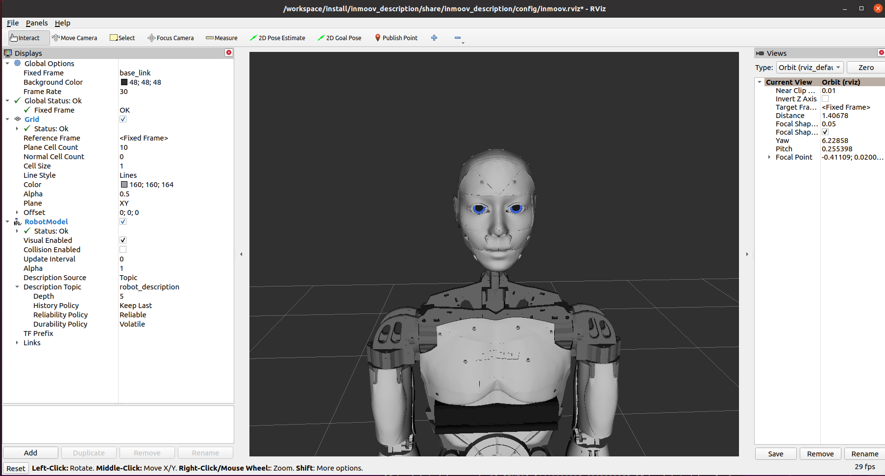

# Running the robot

Open a terminal in the repository and prepare the Pixi runtime once:

```console
pixi run setup-runtime
pixi run build
```

This will take a while on first run. Pixi launch tasks source the local ROS
overlay for you.

For manual ROS commands, either prefix the command with `pixi run` or enter an
activated shell first:

```console
pixi shell
source install/local_setup.sh
```

Now continue instructions in [Bring-up fake (simulated) robot][] or [Bring-up real HW robot][].

[Bring-up fake (simulated) robot]:#bring-up-fake-simulated-robot
[Bring-up real HW robot]:#bring-up-real-hw-robot

## Bring-up fake (simulated) robot

If you just want to test that robot starts, send hand written commands or use the [hand action client][] you don't need to fulfill any other requirement. However, if you want to test the face tracking you need have some webcam hardware. See [Webcam setup in Virtualbox][].

[Webcam setup in Virtualbox]:#webcam-setup-in-virtualbox

You can launch the fake robot in rviz using the launch file. Run the following command in a GUI environment:

```console
pixi run robot-fake
```

This setups fake servo controllers and joint state publishers, and the following window should popup:



Term ["fake hardware"][] means that the hardware mirrors received commands to its states. Ros2 Foxy documentation uses term "fake" but latest releases uses term "mock" talking about same thing.

### Launching the face tracker

If you want to use also the face tracker you need to start it:

```console
pixi run face-tracker
```

If you want to see what the face detection does, run this:

```console
ros2 run rqt_image_view rqt_image_view /face_tracker/image_face
```

This opens the view to see the camera feed and what face detection recognizes.

To get the eyes moving. (Don't be scared about eyes flipping awkwardly to the side. More about this at the end...)

```console
pixi run ros2 run face_tracker_movement face_tracker_movement_node --ros-args -p functionality:=eyes -p simulation:=true
```

Success! You are done. Eyes should "follow" your face. This implementation has a flaw that it is made for the real hardware, so the eye_movement node controls the eyes like it would have the real hardware. In other words, the eyes have different "zero" position in simulation compared to real hardware.

Anyway, you are able to test the face tracking and eye movements like this.

**Note: currently, only jaw, eyes, right hand & head pan movement can be simulated**

To launch the complete demo with fake robot hardware, run:

```console
pixi run robot-demo-fake
```

This uses `full_demo/fake_robot.launch.py` to start each ROS node as its own
process under one ROS 2 launch service. Press Ctrl+C once to stop the complete
demo.

### Launching text-to-speech service

Text-to-speech works as a service which can be called from terminal utilizing the ros2 client in package.

Run the service in a (new) terminal

```console
pixi run tts
```

Call the service from terminal using client and synthetize speech

```console
pixi run ros2 run tts_package client "Tämä lause syntentisoidaan puheeksi."
```

## Bring-up real HW robot

### (0. Test servo communication)

We suggest using [Dynamixel Wizard 2.0][] to test the connection and functionality of the servos before trying to run the robot. This is optional but can save some time debugging if the servos or communication with them doesn't work.

### 1a. Launching the complete real-robot demo

Launch the robot, face tracking, movement, hand control, and voice chatbot from
one terminal:

```console
pixi run robot-demo-real
```

This uses `full_demo/real_robot.launch.py`. ROS 2 starts every node as its own
process and keeps all output in the current terminal. Press Ctrl+C once to stop
the complete demo. Startup problems are usually caused by `robot.launch.py`
being unable to arm or find a servo.

### 1b. Launching the robot (Manual)

You can launch the real robot using a launch file:

```console
pixi run robot
```

This should launch the robot listening server and prints a lot of output. If not, check the [Troubleshooting][] part below. `robot.launch.py` file creates temporary file from [dynamixel_arm.yaml][] and [dynamixel_head.yaml][] to `config/` folder to allow launching the arm and head separately.

[Troubleshooting]:#troubleshooting

To launch only the **arm** hardware

```console
pixi run ros2 launch robot robot.launch.py robot_parts:=arm
```

To launch only the **head** hardware

```console
pixi run robot-head
```

### 1.5 Starting the controllers (Not necessary)

In general you can start the controllers with:

```console
pixi run ros2 control load_controller --set-state start <controller_name>
```

By default all controllers are started automatically by robot.launch.py. Remember to add new controllers you want to launch there. To add a controller you only need to add the controller name into the controllers_to_start-array in robot.launch.py (and rebuild).

### 2. Launching the face tracker

After the required controllers are active, you can start the face tracker and eye movement nodes.

Start the face tracker

```console
pixi run face-tracker
```

If you want to see what the face detection does, run this:

```console
ros2 run rqt_image_view rqt_image_view /face_tracker/image_face
```

This opens the view to see the camera feed and what face detection recognizes.

Finally, start the face tracking movement node in a new terminal window

```console
pixi run face-tracker-movement
```

### 5. Launching text-to-speech service

Text-to-speech works as a service which can be called from terminal utilizing the ros2 client in package.

Run the service in a (new) terminal

```console
pixi run tts
```

Call the service from terminal using client and synthetize speech

```console
pixi run ros2 run tts_package client "Tämä lause syntentisoidaan puheeksi."
```

**Todo: simplify bring up process (add the starting of the controllers to the launch file)**

## Sending action goals manually

The robot head joints doesn't have similar easy to use action client as the arm has. If you want to send action goals to the head you need to start the `head_controller` Then following actions and topics should be available:

```console
$ ros2 action list
/head_controller/follow_joint_trajectory

$ ros2 topic list
/head_controller/joint_trajectory
/joint_states
```

For example, if the joint `head_pan_joint` was configured correctly, it should move to position `0.5` when publishing the following action (other joints will also move to 0 positions if not already):

```console
ros2 action send_goal /head_controller/follow_joint_trajectory control_msgs/action/FollowJointTrajectory "{
  trajectory: {
    joint_names: [head_pan_joint, head_tilt_right_joint, head_tilt_left_joint, head_tilt_vertical_joint],
    points: [
      { positions: [0.5, 0.0, 0.0, 0.0], time_from_start: { sec: 1, nanosec: 0 } }
    ]
  }
}"
```

**Note: When driving the head_tilt_left/right joints, you must move the both servos simulatenously the same amount to the correct directions!**

**Note: The head_tilt_vertical_joint is easily overloaded due to the weight of the head and stickiness of the drive screw, and the servo will stop responding. Requires mechanical improvement.**

If you want to move only one joint at a time, it possible by omitting the other joints:

```console
ros2 action send_goal /head_controller/follow_joint_trajectory control_msgs/action/FollowJointTrajectory "{
  trajectory: {
    joint_names: [head_pan_joint],
    points: [
      { positions: [1.0], time_from_start: { sec: 2, nanosec: 0 } }
    ]
  }
}"
```

The jaw can be controlled with jaw_controller. Value for closed jaw is 0.0 and for open 0.55.

```console
ros2 action send_goal /jaw_controller/follow_joint_trajectory control_msgs/action/FollowJointTrajectory "{
  trajectory: {
    joint_names: [head_jaw_joint],
    points: [
      { positions: [0.55], time_from_start: { sec: 1, nanosec: 0 } }
    ]
  }
}"
```

`time_from_start` is the duration of the movement.

**Note: acceleration and velocity is fixed for real servos currently, so these cannot be controlled. This would require adding velocity and acceleration command interfaces to the JointTrajectoryAction controller**

## Webcam setup in Virtualbox

If you have a integrated webcam in you laptop you can use it. You need to pass the webcam hardware to Ubuntu guest from menu "Devices->Webcam->..." and choose your hardware. If you are using the usb connected external webcam (e.g. the camera integrated to the robot eye) configure it inside the USB settings. Or just pass it to guest with "Devices->USB->..." and choose your webcam.

**If you have issues connecting the camera to guest make sure that you have the matching version of guest additions installed in the guest os.**

To test that OS detects the webcam run:

```console
lsusb -t
```

It should output something like this.

```console
$ lsusb -t
/:  Bus 02.Port 1: Dev 1, Class=root_hub, Driver=xhci_hcd/6p, 5000M
/:  Bus 01.Port 1: Dev 1, Class=root_hub, Driver=xhci_hcd/8p, 480M
    |__ Port 1: Dev 3, If 0, Class=Video, Driver=uvcvideo, 12M
    |__ Port 1: Dev 3, If 1, Class=Video, Driver=uvcvideo, 12M
```

## Troubleshooting

### Dynamixel ID X wasn't found?

Check that [dynamixel_arm.yaml][] and [dynamixel_head.yaml][] have the right IDs and check that the baud rate of servos is set to 57600.

All ID's that you have in the dynamixel_*.yaml files need to be connected for the launch script to work. Comment out all servo ID's that are not connected. No need to remove them from anywhere else.

### But the servo(s) moved yet now doesn't move?!

The servo is likely overloaded. You have to manually reset the servo for it to work again. You can do this by using Dynamixel Wizard to reboot the servo, or alternatively you can turn the power off and on again. You will have to redo the whole bringup in any case.

### `pixi run build` fails

There are various failures that we have seen so far, but here are some of the most common ones

#### 1. CMake clock skew error

CMake compiles the C++ packages and it does not like if temporary file timestamps are in the future. This is most likely due to file synchronization between the host and guest OSes. We have seen this on Windows and Mac hosts with shared VM folders.

Try `pixi run build` again. Sometimes it helps to wait a while for the time difference to settle.

Our suggestion is to test how environment works when folders are not synced from host OS. In other words move the whole development environment to guest OSes virtual disk. 

#### 2. Building just stops to random error

Run `pixi run build` again. If you want to clean first:

```console
pixi run clean
pixi run build --cmake-clean-cache
```

After that, try `pixi run build` again.

#### 3. Build fails to dependency issue

Pixi owns the ROS and Python dependency set for this repository. Add missing
packages to `pixi.toml`, then run `pixi run build` again. Do not use `rosdep`
inside the Pixi environment.


<!-- References -->

[dynamixel_arm.yaml]:../config/dynamixel_arm.yaml
[dynamixel_head.yaml]:../config/dynamixel_head.yaml
[hand action client]:../client/README.md

[Dynamixel Wizard 2.0]: https://emanual.robotis.com/docs/en/software/dynamixel/dynamixel_wizard2/
["fake hardware"]: https://control.ros.org/galactic/doc/ros2_control/hardware_interface/doc/fake_components_userdoc.html
