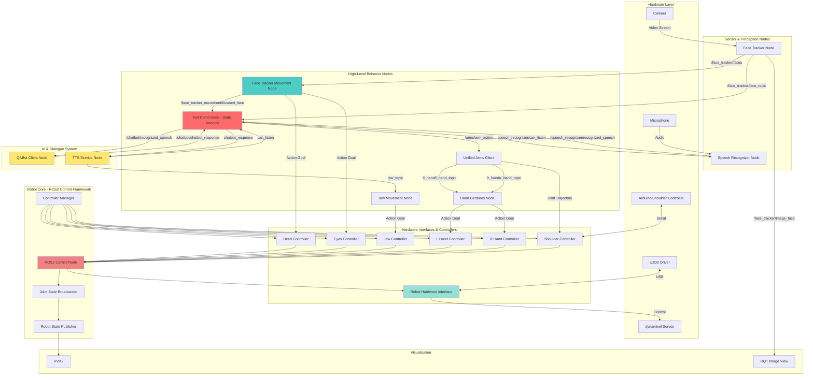

# SOP Robot Control Flow Graph

This document provides a comprehensive control flow graph of the SOP Robot system, showing how all components interact and communicate.



## Component Descriptions

### Hardware Layer
- **U2D2**: USB-to-Dynamixel communication interface
- **Dynamixel Servos**: Physical servo motors controlling robot joints
- **Camera**: Visual input for face detection
- **Microphone**: Audio input for speech recognition
- **Arduino**: Additional controller for shoulder servos

### Robot Core
- **ROS2 Control Node**: Central controller managing hardware interfaces
- **Controller Manager**: Spawns and manages individual joint controllers
- **Joint State Broadcaster**: Publishes current joint states to ROS
- **Robot State Publisher**: Converts joint states to TF transforms

### Controllers
Each controller manages specific robot joints:
- **Head Controller**: Head pan and tilt movements
- **Eyes Controller**: Eye movement
- **Jaw Controller**: Jaw opening/closing
- **Hand Controllers**: Finger movements (left/right)
- **Shoulder Controller**: Arm/shoulder movements

### Perception Nodes
- **Face Tracker**: Detects and tracks faces in camera feed
- **Speech Recognizer**: Converts microphone audio to text

### Behavior Nodes
- **Face Tracker Movement**: Coordinates head/eye movement to track faces
- **Full Demo**: Main state machine coordinating robot behaviors
- **Hand Gestures**: Executes hand pose commands
- **Unified Arms**: Controls arm movements and gestures
- **Jaw Movement**: Synchronizes jaw with speech

### AI & Dialogue
- **QABot**: Processes questions using document retrieval and generates responses
- **TTS Service**: Converts text to speech and publishes jaw movements

## Control Flow

### 1. Initialization
```
start_robot_head script
├── Launch robot.launch.py (ROS2 Control)
├── Launch face_tracker
├── Launch face_tracker_movement
├── Launch full_demo
├── Launch hand_gestures
├── Launch qabot
├── Launch speech_recognizer
├── Launch unified_arms_client
└── Launch tts_service
```

### 2. Face Detection & Tracking Flow
```
Camera → Face Tracker → [Face List] 
    ↓
Face Tracker Movement → [Action Goals]
    ↓
Head Controller + Eyes Controller → Dynamixel Servos
```

### 3. Speech & Dialogue Flow
```
Microphone → Speech Recognizer → [Recognized Text]
    ↓
Full Demo Node (State: LISTENING → THINKING)
    ↓
QABot → [Response Text]
    ↓
TTS Service → [Audio + Jaw Commands]
    ↓
Jaw Movement → Jaw Controller → Dynamixel Servos
```

### 4. Gesture & Arm Control Flow
```
Full Demo → [Arm Action Command]
    ↓
Unified Arms Client → [Hand Gesture Topics]
    ↓
Hand Gestures Node → [Action Goals]
    ↓
Hand Controllers → Dynamixel Servos
```

### 5. Interaction State Machine (Full Demo Node)

```
IDLE
  ├─ Face detected → Say "Hei, kysy minulta mitä vaan"
  │                  ├─ Arm: hold gesture
  │                  └─ Switch to LISTENING
  │
LISTENING (30s timeout)
  ├─ Speech recognized → Switch to THINKING
  ├─ Timeout (30s) → Switch to IDLE
  │
THINKING
  ├─ Query QABot → Receive response
  │                ├─ Play TTS
  │                ├─ Move jaw
  │                └─ Switch to LISTENING after TTS completes
```

## Topic & Action Communication

### Main Topics
- `/face_tracker/faces` - Detected faces list
- `/face_tracker/image_face` - Face-detected image stream
- `/speech_recognizer/recognized_speech` - Recognized text
- `/chatbot_response` - Generated responses
- `/arms/arm_action` - Arm movement commands
- `/l_hand/l_hand_topic`, `/r_hand/r_hand_topic` - Hand gesture commands
- `can_listen` - TTS ready/not ready status

### Main Actions
- `/head_controller/follow_joint_trajectory`
- `/eyes_controller/follow_joint_trajectory`
- `/jaw_controller/follow_joint_trajectory`
- `/r_hand_controller/follow_joint_trajectory`
- `/l_hand_controller/follow_joint_trajectory`
- `/shoulder_controller/follow_joint_trajectory`

## Key Design Patterns

1. **Action-Based Control**: Controllers use ROS2 actions for trajectory execution
2. **Publisher-Subscriber**: Loosely coupled communication between nodes
3. **State Machine**: Full Demo node manages robot interaction states
4. **Hardware Abstraction**: Robot Hardware Interface abstracts servo communication
5. **Modular Architecture**: Each behavior is an independent ROS2 node
