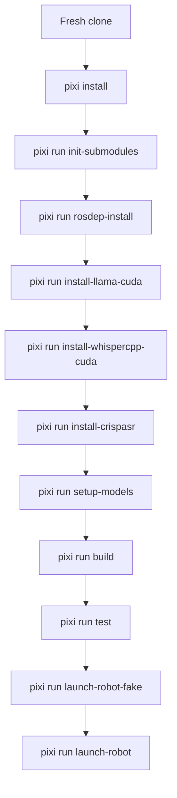

# Development Setup

This workspace targets Ubuntu 22.04 with ROS 2 Humble.

## Dependency Ownership

Dependency installation is split deliberately:

- `pixi` owns Python, ML, Qt, and the bulk of the ROS user-space packages
- `rosdep` is used only for Ubuntu-host dependencies that are intentionally left
  outside Pixi
- `colcon` builds the active workspace packages after both dependency layers are
  in place

Today the main Ubuntu-host dependency left to `rosdep` is `espeak` for TTS.

## Fresh Ubuntu 22.04 Setup

Install the system prerequisites:

```bash
sudo apt update
sudo apt install -y git curl python3-rosdep
sudo rosdep init || true
rosdep update
```

Install Pixi:

```bash
curl -fsSL https://pixi.sh/install.sh | bash
```

Clone and bootstrap the workspace:

```bash
git clone --recurse-submodules <repo-url> SOP-Robot
cd SOP-Robot
pixi run bootstrap
```

If you prefer the steps explicitly:

```bash
pixi install
pixi run init-submodules
pixi run rosdep-install
pixi run install-llama-cuda
pixi run install-whispercpp-cuda
pixi run install-crispasr
pixi run setup-models
pixi run build
pixi run test
```

If you are bringing up the real robot hardware, also install the Dynamixel udev
rule:

```bash
pixi run setup-udev
```

## Daily Workflow

Common developer commands:

```bash
pixi run lint
pixi run typecheck
pixi run test
pixi run check
pixi run launch-robot-fake
pixi run launch-robot
```

## LLM CUDA Offload

The voice LLM uses `llama-cpp-python`. Run this after `pixi install` on an
NVIDIA WSL2 machine:

```bash
pixi run install-llama-cuda
```

The task rebuilds `llama-cpp-python` against the Pixi CUDA 13 toolkit, detects
the local GPU compute capability, and verifies that llama.cpp GPU offload is
enabled. The runtime config uses `llm_n_gpu_layers: -1`, which requests all
supported GGUF layers on CUDA.

## Whisper.cpp CUDA

The pywhispercpp ASR backend uses whisper.cpp. Run this after `pixi install` on
an NVIDIA machine:

```bash
pixi run install-whispercpp-cuda
```

The task rebuilds pywhispercpp with CUDA if the installed wheel has no CUDA
backend, and repairs pywhispercpp wheels that vendor a `libcuda` stub by linking
that bundled name to the real NVIDIA driver library. On WSL2 this is normally
`/usr/lib/wsl/lib/libcuda.so.1`.

## CrispASR CUDA

The `crispasr` ASR backend uses a local build of
`https://github.com/CrispStrobe/CrispASR` plus the Parakeet GGUF model. Run this
after `pixi install`:

```bash
pixi run install-crispasr
```

The task reads the CrispASR paths from `config/voice_chatbot.json`, clones the
repo to `/home/aapot/CrispASR` when it is missing, downloads
`parakeet.gguf`, and builds with:

```bash
cmake -B build -DCMAKE_BUILD_TYPE=Release -DGGML_CUDA=ON -DGGML_CUDA_ENABLE_UNIFIED_MEMORY=1 -DCMAKE_CUDA_ARCHITECTURES=<detected>
cmake --build build --parallel "$(nproc)" --target crispasr
```

On this RTX 5070 WSL2 setup the detected CUDA architecture is `120`, matching
the manual build command. Older CrispASR checkouts may still expose the target
as `whisper-cli`; the installer detects either target. On a host without CUDA it
builds CPU-only unless `CRISPASR_ENABLE_CUDA=1` is set. Use
`CRISPASR_FORCE_REBUILD=1` to force a reconfigure/rebuild and
`CRISPASR_UPDATE=1` to fast-forward an existing git checkout before building.

The helper scripts under `tools/` now auto-enter the Pixi environment when
needed, so these also work outside an already-activated Pixi shell:

```bash
bash tools/lint.sh
bash tools/typecheck.sh
bash tools/test.sh
bash tools/launch_robot_fake.sh
```

## Runtime Config Files

The runtime config split is:

- `config/robot_stack.yaml`: stack-wide launch defaults and feature toggles
- `config/voice_chatbot.json`: editable runtime voice config
- `config/voice_chatbot.defaults.json`: shipped voice defaults
- `models/sop_robot_llm_knowledge_base.sqlite3`: generated SQLite index for
  `legacy/chatbot/chatbot/data`

`robot.launch.py` merges explicit launch arguments with `config/robot_stack.yaml`
and falls back to `src/sop_robot_bringup/robot/config/robot_stack.defaults.yaml` if the root config
is missing.

## Control Flow



## Notes

- The canonical launch pair is always `robot.launch.py` and `robot.fake.launch.py`.
- Package-local launch files are for focused subsystem debugging, not primary bring-up.
- Legacy `voice_chatbot_ros` code has been migrated into the split voice-stack
  packages and removed. Other archived chatbot experiments remain excluded from
  the active lint, typecheck, and colcon graph.
