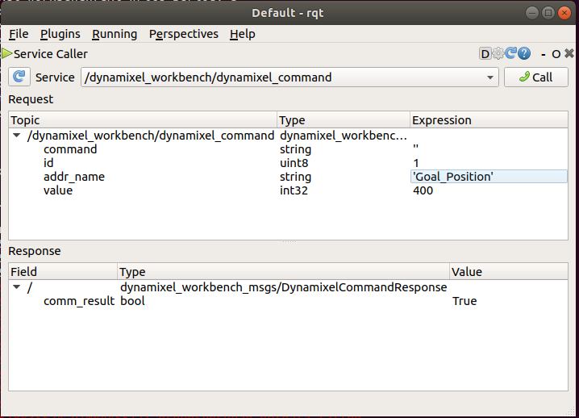

## Servos

Dynamixel ROS instructions are [here](http://emanual.robotis.com/docs/en/software/dynamixel/dynamixel_workbench/).

How to find connected dynamixel servos (serial port could be different for you):

```sh
$ rosrun dynamixel_workbench_controllers find_dynamixel /dev/ttyUSB0
[ INFO] [1578781097.059273105]: Succeed to init(9600)
[ INFO] [1578781097.059380826]: Wait for scanning...
[ INFO] [1578781118.899728953]: Find 1 Dynamixels
[ INFO] [1578781118.899810859]: id : 1, model name : XL-320
[ INFO] [1578781118.903439606]: Succeed to init(57600)
```

```sh
ros2 launch launch/dynamixel-test.launch
```

Commands can be send to servos using rqt when testing:



Address names are in `Camel_Case`.
Check the [dynamixel_item.cpp](https://github.com/ROBOTIS-GIT/dynamixel-workbench/blob/master/dynamixel_workbench_toolbox/src/dynamixel_workbench_toolbox/dynamixel_item.cpp) for full list of address names.

Note that servo communication packet timeout values were increased in [protocol2_packet_handler.cpp](src/DynamixelSDK/ros/src/dynamixel_sdk/protocol2_packet_handler.cpp)
to suit the Arduino. If you run into servo communication problems (such as `There is no status packet!`) you may want to change those.
Feel free to improve the arduino controller; for example,
by using tri-state buffer (see [this](https://robottini.altervista.org/dynamixel-ax-12a-and-arduino-how-to-use-the-serial-port))

Now that we have verified that the servo can be controlled,
let's move to configuring and testing joints.
Joint communication happens using topics.
Dynamixel_workbench
publishes following topics:

```sh
$ ros2 topic list
/dynamixel_state
/joint_states
/joint_trajectory
/parameter_events
/rosout
```

The type of the topic can be seen as follows:
```sh
$ ros2 topic type /inmoov/joint_trajectory
trajectory_msgs/JointTrajectory
```

The message structure can be seen using `ros2 interface show` command:
```sh
$ ros2 interface show trajectory_msgs/msg/JointTrajectory
# The header is used to specify the coordinate frame and the reference time for
# the trajectory durations
std_msgs/Header header

# The names of the active joints in each trajectory point. These names are
# ordered and must correspond to the values in each trajectory point.
string[] joint_names

# Array of trajectory points, which describe the positions, velocities,
# accelerations and/or efforts of the joints at each time point.
JointTrajectoryPoint[] points
```

Example joint config:

```yaml
head_pan_joint:
  ID: 1 # servo id
  Return_Delay_Time: 0
```

If the joint was configured correctly, it should move to position 1
when publishing the following message:

```sh
ros2 topic pub --once /joint_trajectory trajectory_msgs/msg/JointTrajectory "{joint_names: [\"head_pan_joint\"], points: [{positions: [1], velocities: [1], accelerations: [1], effort: [1], time_from_start: {sec: 0, nanosec: 0}  }]}"
```

Read more about the YAML command line:
http://wiki.ros.org/ROS/YAMLCommandLine

## MoveIt!


https://moveit.ros.org/documentation/concepts/

You can edit the moveit config package as shown here:
http://docs.ros.org/melodic/api/moveit_tutorials/html/doc/setup_assistant/setup_assistant_tutorial.html

The moveit config is in `src/moveit_config`.

Feel free to create pull requests.
