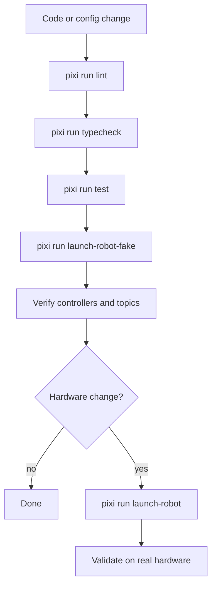

# Testing

The active test flow is now anchored to the Pixi tasks and the canonical robot
launch pair.

## Fast Checks

Run these from the repository root:

```bash
pixi run lint
pixi run typecheck
pixi run test
pixi run check
```

Task meanings:

- `lint`: Ruff over the active workspace only
- `typecheck`: basedpyright over the active workspace only
- `test`: fast Python unit tests that do not require hardware
- `check`: lint + typecheck + test

## Current Fast Test Suite

The fast unit tests currently cover:

- `src/sop_robot_bringup/robot/launch/test/test_launch_utils.py`
- `src/sop_robot_perception/face_tracker_movement/test/test_face_tracker_movement_logic.py`
- `src/sop_robot_voice/llm_package/test/test_knowledge_base.py`
- `src/sop_robot_voice/llm_package/test/test_llm_engine.py`
- `src/sop_robot_voice/voice_stack_common/test/test_config.py`
- `src/sop_robot_common/test/test_contracts.py`

These tests validate the launch-config merge helpers, motion math, and shared
topic/config contracts without needing a microphone or robot hardware. The LLM
tests also validate SQLite ingestion and deterministic local-data answers
without loading a GGUF model.

## Recommended Validation Order

1. Run `pixi run check`.
2. Run `pixi run test-robot-one-by-one`.
3. Run `pixi run test-robot-all-at-once`.
4. Only then run `pixi run launch-robot` on hardware.

## Automatic Stack Tests

The automatic stack tester launches the fake robot, checks the ROS graph, and
writes per-scenario launch logs under `test-results/`.

Run every subsystem separately:

```bash
pixi run test-robot-one-by-one
```

Run the full fake stack in one launch:

```bash
pixi run test-robot-all-at-once
```

The tester expects no previous robot launch to be running. It validates nodes,
topics, services, action servers, and selected live topics such as
`/joint_states`, `/image_raw`, `/face_tracker/image_face`, and
`/voice_chatbot/status`.

Useful focused runs:

```bash
pixi run test-robot-one-by-one -- --scenario face_tracker
pixi run test-robot-one-by-one -- --scenario voice_stack --no-live-topics
pixi run test-robot-all-at-once -- --no-live-topics
```

By default, the automatic tests keep GUI/RViz disabled so they can run from a
terminal. To smoke-test those process launches during the all-at-once run:

```bash
pixi run test-robot-all-at-once -- --include-gui --include-rviz
```

The automatic fake-stack tests launch ASR with `asr_test_mode:=true`. That
keeps the ROS voice contracts active without opening a microphone, so the tests
can run on machines where PortAudio has no input device. Normal robot launches
still use real microphone capture unless you explicitly pass that launch
argument.

## LLM Knowledge Base Tests And Benchmarks

The LLM package can ingest `legacy/chatbot/chatbot/data` into SQLite and answer
exact known questions directly before using the GGUF model.

Smoke-test the full local data ingest:

```bash
pixi run test-llm-knowledge
```

Generate mixed evaluation data from the local chatbot corpus. The generated
JSONL contains exact KB pairs, similar reworded questions, intentionally mixed
wrong answers, and very different questions that should not be answered from the
KB:

```bash
pixi run generate-llm-knowledge-eval
```

Compare deterministic answers with the KB disabled versus enabled:

```bash
pixi run test-llm-knowledge-compare
```

Run the adaptive learning check with separate Oulu and university correction
data. The test starts from `testing/fixtures/llm/oulu_university_seed.yml`,
queries correction cases from `testing/fixtures/llm/oulu_university_corrections.yml`,
writes missing or corrected answers into the SQLite KB, and reruns each case:

```bash
pixi run test-llm-knowledge-learning
```

Verify that already-correct Oulu and university data starts correct and does
not create learned correction rows:

```bash
pixi run test-llm-knowledge-correct
```

Try one model directly, with no SQLite KB, no retrieval context, no answer
selection between KB and model, and no learning:

```bash
SOP_ROBOT_LLM_BENCH_N_CTX=2048 SOP_ROBOT_LLM_BENCH_MAX_TOKENS=96 pixi run try-llm-model -- \
  --model ahma=llama-cpp:/home/aapot/SOP-Robot/models/Ahma-2-4B-Instruct.Q4_K_S.gguf \
  --prompt "Kerro yhdellä lauseella Oulusta."
```

Compare several model commands with the KB disabled and enabled. Without
arguments this uses deterministic simulated models, so it is safe for fast local
testing:

```bash
pixi run test-llm-models
```

Benchmark exact, FTS, LIKE, and auto retrieval with timing and memory details:

```bash
pixi run benchmark-llm-knowledge
```

Benchmark several model commands with KB/no-KB accuracy, timing, and memory
details:

```bash
pixi run benchmark-llm-models
```

Real model commands are passed as repeatable `NAME=COMMAND` values. Local
GGUF files can run in-process with `llama-cpp:/path/to/model.gguf`; Hugging
Face GGUF files can run with `llama-cpp-hf:repo_id:filename`. The in-process
benchmark path sends text-only chat messages.

```bash
SOP_ROBOT_LLM_BENCH_N_CTX=2048 SOP_ROBOT_LLM_BENCH_MAX_TOKENS=96 pixi run benchmark-llm-models -- \
  --model ahma=llama-cpp:models/Ahma-2-4B-Instruct.Q4_K_S.gguf \
  --model llama31=llama-cpp:models/Meta-Llama-3.1-8B-Instruct-Q4_K_M.gguf \
  --model gemma4=llama-cpp-hf:unsloth/gemma-4-E4B-it-GGUF:gemma-4-E4B-it-Q4_K_S.gguf
```

The same text-only model set is available as a shortcut:

```bash
SOP_ROBOT_LLM_BENCH_N_CTX=2048 SOP_ROBOT_LLM_BENCH_MAX_TOKENS=96 pixi run benchmark-llm-text-models
```

To include a model or other external responder in the benchmark, pass a command
that accepts a JSON payload on stdin with `model`, `mode`, `question`, `case`,
and `retrieval`, and prints one answer on stdout:

```bash
pixi run benchmark-llm-knowledge -- --model-command "python my_model_runner.py"
```

## Topic Monitoring And Graphs

Use the topic monitor while the fake or real robot is already running. It
subscribes to active topics and reports rate, expected-rate status, header-stamp
latency, period jitter, message size, and bandwidth.

Live terminal monitor:

```bash
pixi run monitor-topics
```

Generate a static relationship graph without sampling performance:

```bash
pixi run topic-graph
```

Generate the full overview report:

```bash
pixi run topic-overview
```

`topic-overview` samples for 10 seconds by default and writes `.html`, `.json`,
`.csv`, and `.dot` files under `reports/`. Open the HTML file to see publishers,
topics, subscribers, and per-topic performance on one page. Focused examples:

```bash
pixi run topic-overview -- --duration 20 --print
pixi run monitor-topics -- --topic /image_raw --topic /face_tracker/image_face
pixi run monitor-topics -- --expect /image_raw=45 --expect /face_tracker/image_face=40
```

The implementation is intentionally in-tree so it works from the Pixi ROS
environment without cloning extra packages. It follows the same split as
Greenwave Monitor and ros2graph_explorer: a low-overhead topic performance
subscriber plus a static browser graph for understanding ROS topic
relationships.

## ros2graph_explorer Web UI

The upstream `ros2graph_explorer` package is vendored under
`src/vendor/ros2graph_explorer` and built with the workspace. It serves an interactive
browser UI for the live ROS graph, including node/topic overlays, QoS details,
topic stats, topic echo, parameter editing, and service calls.

Launch it against any already-running ROS graph:

```bash
pixi run ros2graph-ui
```

Then open:

```text
http://127.0.0.1:8734/
```

The normal robot config enables it by default, so `pixi run launch-robot-fake`
and `pixi run launch-robot` also expose the same page. To launch without it:

```bash
pixi run launch-robot-fake -- enable_ros2graph_ui:=false
```

To change the web bind address or port for a one-off launch:

```bash
pixi run launch-robot-fake -- ros2graph_web_host:=127.0.0.1 ros2graph_web_port:=9001
```

## Face Tracker Benchmarks

Use the face tracker benchmark when changing camera or tracker settings. It
captures a fixed frame sample once, then replays the same frames through each
setting so DroidCam/network jitter does not bias the comparison.

Quick synthetic no-face benchmark:

```bash
pixi run benchmark-face-tracker -- --source synthetic:blank --sample-frames 120
```

DroidCam benchmark:

```bash
pixi run benchmark-face-tracker -- \
  --source http://192.168.101.101:4747/video \
  --sample-frames 180 \
  --profile quick
```

To include approximate annotated-image conversion cost, add:

```bash
--include-image-conversion
```

Results are written to `benchmarks/face_tracker_<timestamp>.csv` and `.json`.
The main columns to compare are `fps`, `p95_ms`, `max_ms`,
`detector_call_rate`, and `mean_faces`.

The default benchmark tests the direct OpenCV YuNet path. To include the
optional Ultralytics/YOLO path, pass `--detectors yunet,yolo`; run that as a
separate comparison because native CUDA failures in the YOLO stack can terminate
the Python process before it can report a normal exception.

GPU/YOLO benchmark:

```bash
pixi run benchmark-face-tracker-gpu -- \
  --source http://192.168.101.101:4747/video \
  --sample-frames 180 \
  --profile matrix
```

The GPU task enables `--gpu`, which selects the optional YOLO detector and runs
each scenario in an isolated child process. If one CUDA setting crashes
natively, the CSV row is marked `failed` and the rest of the benchmark
continues.

## Testing Flow



## What To Re-Run

- Changed Python package code: `pixi run check`
- Changed launch files or `config/robot_stack.yaml`: `pixi run check` then `pixi run launch-robot-fake`
- Changed voice contract or voice config loading: `pixi run check` then fake bring-up with `enable_voice_stack:=true`
- Changed robot hardware or controllers: fake bring-up first, then real bring-up

## Notes

- The fake robot launch is the default integration test surface.
- Archived packages are intentionally excluded from the active lint/typecheck flow.
- The ASR node still needs a real microphone for end-to-end capture tests; the
  fast checks only validate imports, contracts, and logic paths that do not need audio hardware.
