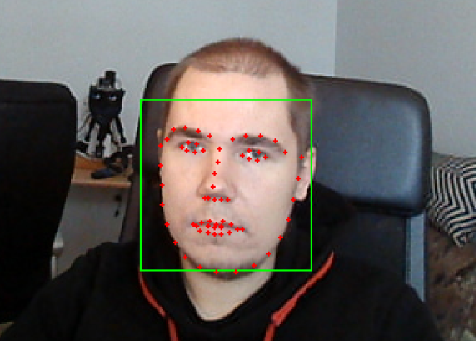

This package contains a node that publishes image with the detected faces for debugging purposes and a message that contains location and landmarks of the detected faces. For the purpose of testing other functionality, such as eye movements, separately from face tracking, a mock face tracker node is also included.



## Parameters
These can be modifien in:
`launch/face_tracker.test.launch.py`

face_tracker_node:

| Name                      | Description                                                                          | Default                                       |
| ------------------------- | :----------------------------------------------------------------------------------: | --------------------------------------------: |
| lip_movement_detection    | Enable lip-movement analysis                                                          | False                                         |
| face_recognition          | Enable identity embeddings and clustering (CPU SFace by default)                    | False                                         |
| correlation_tracking      | Track faces between detector runs                                                     | True                                          |
| cluster_similarity_threshold    | Treshold parameter for face clustering                                         | 0.3                                           |
| subcluster_similarity_threshold | Treshold parameter for face clustering                                         | 0.2                                           |
| pair_similarity_maximum   | pair_similarity_maximum parameter for face clustering                                | 1.0                                           |
| face_recognition_model    | Face recognition model from deepface                                                 | "SFace"                                       |
| face_detection_model      | Face detection model from DeepFace                                                   | "yolov8"                                      |
| inference_device          | PyTorch detector device; falls back to CPU when CUDA is unavailable                  | "cuda:0"                                      |
| detection_interval        | Run detection every N frames and track between runs                                  | 10                                            |
| detection_scale           | Scale applied before face detection                                                   | 0.5                                           |
| publish_debug_image       | Draw annotations and publish the full debug image                                     | True in launch                                |
| debug_image_scale         | Debug-preview scale; 0.5 publishes 640x480 from a 1280x960 camera                    | 0.5                                           |
| image_topic               | Input rgb image                                                                      | /image_raw                                    |
| image_face_topic          | Output image with faces surrounded by triangles and face landmarks shown as circle   | image_face                                    |
| face_topic                | Output face and face landmark positions in the frame                                 | faces - face_tracker_msgs.msg.Faces           |
| predictor                 | Shape predictor data for landmarks. Used by lip_movement_detector.                   | shape_predictor_68_face_landmarks.dat         |
| lip_movement_detector     | Lip_movement model                                                                   | 1_32_False_True_0.25_lip_motion_net_model.h5  |

! Notice: If `face_recognition_model` or `face_detection_model` is changed, also `cluster_similarity_threshold`, `subcluster_similarity_threshold` and `pair_similarity_maximum` have to be adjusted.

The default low-latency profile runs YOLOv8-face on CUDA at half resolution every tenth
frame. Dlib correlation tracking fills the intervening frames. Identity recognition and
lip analysis are disabled because they add CPU work. The debug preview uses a one-frame,
best-effort queue and is scaled to 640x480 so viewers do not accumulate stale frames.

The first launch downloads the approximately 6 MB YOLOv8-face weights to
`~/.deepface/weights/yolov8n-face.pt`.

Webcam_node:

| Name             | Description                                                   | Default    |
| ---------------- | :-----------------------------------------------------------: | ---------: |
| raw_image        | Raw image output topic                                        | /image_raw |
| index            | Device index, 0 for /dev/video0.                              | 0          |
| width            | Device width in pixels. Specify 0 for default.                | 1280       |
| height           | Device height in pixels. Specify 0 for default.               | 960        |
| fps              | Framerate. Specify 0 to publish at default (device) framerate | 30         |
| mjpg             | Use mjpg compression, Specify False for default               | True       |

Command `v4l2-ctl --list-formats-ext` can be used to determine, which webcam parameters can be used, if you are not satisfied with the default parameters. Using mjpg compression usually allows larger resolution and fps, but the image quality is lower.
## Testing

The following launches the camera and face detector nodes. By default, it uses the first camera (`/dev/video0`).

```console
ros2 launch face_tracker face_tracker.test.launch.py
```

To view the camera feed, run: `ros2 run rqt_image_view rqt_image_view` and select the appropriate topic from the list.


The following launches the mock face tracker node. 
!!! The mock face tracker needs to be updated !!!

```console
ros2 run face_tracker mock_face_tracker_node
```
To use it, simply enter the desired coordinates on a single line, separated by either a comma or a space. The coordinates will then be published as a detected face location.


## Dependencies

(Not required for the mock face tracker)
* `Video4Linux2`
* `dlib`
* `opencv-python`
* `deepface`
* CUDA-enabled `torch`
* `ultralytics`

## Potential future improvements

* Save recognized faces to some kind of database
* Correlation tracking blocks face recognition and detection. Separate correlation tracking to different thread than face detection and recognition. - Allows usage of higher demand face recognition models.
