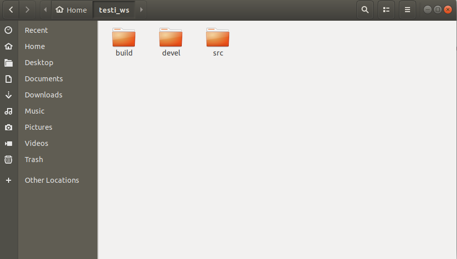
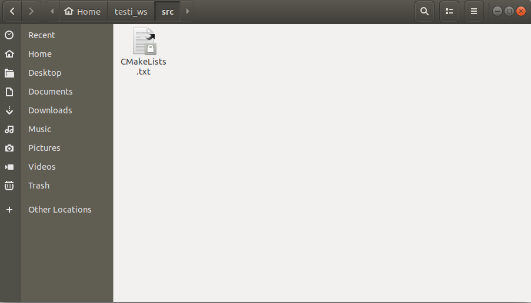
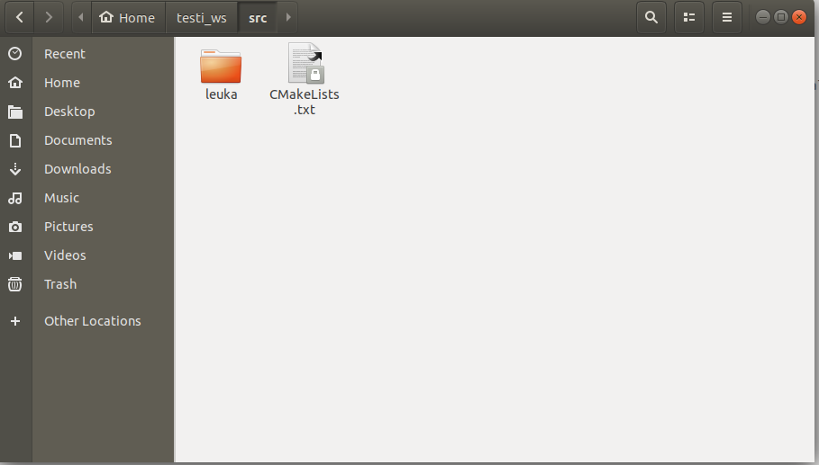
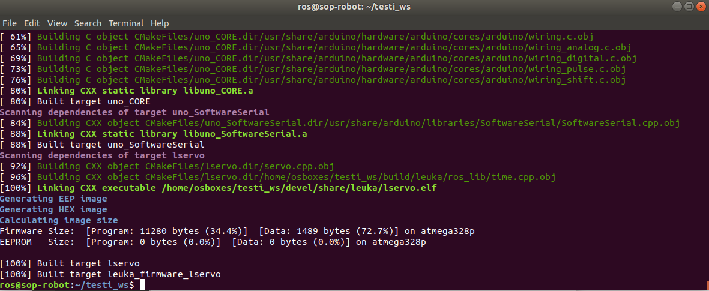
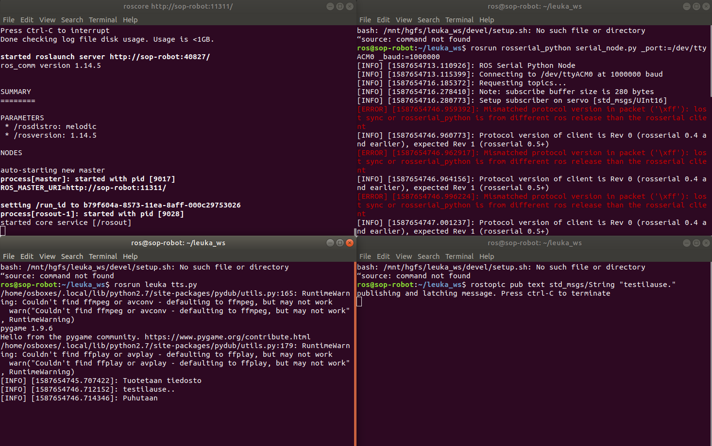

# SOP-leuka
SOP-kurssin puhesynteesi- ja leukaryhmän repository.

## Huomattavia seikkoja

Python: On testattu ja toimii Python-versiolla 2.7.17. Pythonissa tarvittavia kirjastoja ovat ainakin numpy, scipy, pygame, soundfile, playsound, wave, sys, rospy ja pydub, kannattaa asennella ne pip:illä ennen paketin käyttöä, esim. pip install pygame.

ROS: On testattu ja toimii ros-melodic:illa. Tarvitaan paketteja rosserial_arduino, rosserial_python, rosserial_client, roscpp, rospy ja std_msgs. Jos tulee ongelmia puuttuvien pakettien kanssa, asenna ne näin: sudo apt-get ros-melodic-puuttuva-paketti, esim. sudo apt-get ros-melodic-rosserial-arduino

Arduino: On testattu ja toimii Arduino IDE versiolla 1.8.9. 


## Käyttöohjeet

1. Tee oma catkin workspace
  ```
mkdir -p ~/oma_ws/src
cd oma_ws
catkin_make
source devel/setup.bash
  ```
Tuloksena tällainen rakenne:



2. Kopioi kansio 'leuka' oman workspacen src kansioon (jätä src-kansion sisäinen CMakeLists.txt rauhaan) 

Kansion src sisältö ennen:



Ja jälkeen:



3. Ja tee sitten catkin_make 

```
cd oma_ws
catkin_make
```
Tuloksena pitäisi olla jotakuinkin tällaiset ilmoitukset:




4. Yhdistä arduino koneeseen (ja odota hetki että kone tunnistaa arduinon) ja servo arduinoon (servon datapinni arduinon pinniin 1, VCC arduinon pinniin 5V ja GND arduinon pinniin GND) ja aja seuraava komento, jolloin koodi uploadaa arduinolle
```
catkin_make leuka_firmware_lservo-upload
```
Tuloksena pitäisi olla jotakuinkin tällaiset ilmoitukset:


5. Avaa 5 eri komentoriviä auki käyttöä varten
	1.  ```roscore ```
	2.  ``` rosrun rosserial_python serial_node.py _port:=/dev/ttyACM0 _baud:=1000000  ```   (servon noden käynnistys)
	3.  ```rosrun leuka tts.py  ```   (puhesynteesin noden käynnistys)
	4.  ```rostopic pub text std_msgs/String "testilause."   ```  (text-kanavalle annetaan syötteeksi haluttu lause)

	Halutessa voidaan myös muuttaa asetuksia, avaa jokaista varten oma komentorivi kun puhesynteesi on käynnistetty
	- rostopic pub gender std_msgs/String <tähän "woman" tai "man"> (huom! ei valittavissa formanttisynteesille)
	- rostopic pub tts_type std_msgs/String <tähän "concat" tai "formant"> (synteesin tyyppi; on oletuksena concat, käytä formant omalla vastuulla, sillä sen synkka ei ole niin hyvä)
	
	Ja kun asetusten vaihdon viesti on julkaistu, paina Ctrl-C, ennen kuin jatkat vaiheeseen (iv).
	
	Jos haluat vaihtaa puhuttavaa lausetta, paina Ctrl-C komentorivillä (iv) , vaihda lause ja aja vaihe sitten uudestaan. Ei tarvitse sulkea joka välissä komentorivejä (i) - (iii).


Jos tulee erroria, että pakettia leuka ei löydetä, tee catkin_make ja source uudestaan. 

Pelkän servon toimintaa voidaan testata avaamalla komentorivit (i) ja (ii) ja kolmanneksi jompikumpi seuraavista:
- rostopic pub servo std_msgs/UInt16 <tähän luku 1 tai 0> (jos haluat testata servon yhtä liikahdusta)
- rosrun leuka talker   (jos haluat servon liikkuvan eestaas nopeasti -testi)

Pelkän puhesynteesin toimintaa voidaan testata jättämällä komentorivi (ii) käynnistys pois välistä.

Tältä näyttää kokonaisuudessaan puhesynteesin + servon ajaminen. Vaihe (ii) heittää mismatch-erroria mutta kaikki toimii kuitenkin kuten pitää. 




