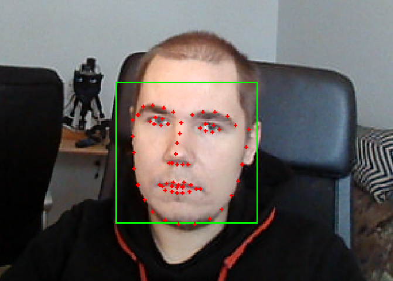

This package contains a node that publishes image with the detected faces for debugging purposes and a message that contains location and landmarks of the detected faces. For the purpose of testing other functionality, such as eye movements, separately from face tracking, a mock face tracker node is also included.



For full-robot bring-up, the canonical entrypoint is `robot.launch.py` or
`robot.fake.launch.py`. `face_tracker.test.launch.py` is kept as a focused
subsystem launch for debugging the camera and face detection path.

## Parameters
These can be modifien in:
`launch/face_tracker.test.launch.py`

face_tracker_node:

| Name                      | Description                                                                          | Default                                       |
| ------------------------- | :----------------------------------------------------------------------------------: | --------------------------------------------: |
| lip_movement_detection    | enable lip_movement_detection                                                        | True                                          |
| face_recognition          | enable face_recognition                                                              | True                                          |
| correlation_tracking      | track faces between detector passes to avoid running face detection on every frame    | True                                          |
| cluster_similarity_threshold    | Treshold parameter for face clustering                                         | 0.3                                           |
| subcluster_similarity_threshold | Treshold parameter for face clustering                                         | 0.2                                           |
| pair_similarity_maximum   | pair_similarity_maximum parameter for face clustering                                | 1.0                                           |
| face_recognition_model    | Face recognition model from deepface                                                 | "SFace"                                       |
| face_detection_model      | Face detection model. `yunet` uses direct OpenCV FaceDetectorYN.                     | "yunet"                                       |
| prefer_gpu                | Use the optional PyTorch/YOLO detector instead of OpenCV YuNet.                      | False                                         |
| gpu_face_recognition_model | Optional recognition model override for TensorFlow-capable systems                    | "SFace"                                       |
| gpu_face_detection_model  | GPU-capable detector used when `prefer_gpu` is enabled; `yolov8n` uses local `yolov8n-face.pt` | "yolov8n"                         |
| face_detection_confidence | Minimum confidence for face detections                                               | 0.6                                           |
| face_detection_imgsz      | YOLO detector inference image size. Only used by the optional YOLO detector.         | 640                                           |
| no_face_detection_interval_frames | When no face is present, run detector only every nth processed frame. `1` disables this. | 1                                    |
| no_face_detection_warmup_frames | Detector frames to run before entering no-face scan mode.                      | 3                                             |
| face_detection_interval_frames | Run detector every nth processed frame when correlation tracking is enabled    | 5                                             |
| max_processing_fps        | Maximum tracker processing rate. Use 0 for unlimited.                                | 30.0                                          |
| processing_width          | Downscale frames to this width before face analysis. Use 0 for original size.        | 640                                           |
| publish_face_image        | Publish annotated debug image                                                        | True                                          |
| face_image_publish_every_n_frames | Publish annotated image every nth processed frame                         | 1                                             |
| face_image_publish_fps    | Optional cap for annotated image publishing. Use 0 for immediate latest-frame publishing. | 0.0                                      |
| face_correlation_tracking | Use dlib correlation tracking between detector passes                                | False                                         |
| face_detection_interval_frames | Run heavy face detection every nth processed frame; tracking runs between detections | 1                                          |
| async_processing          | Process only the latest camera frame on a worker thread                              | True                                          |
| slow_frame_warning_seconds | Warn when a single tracker processing pass exceeds this duration; 0 disables logs    | 1.0                                           |
| face_image_max_width      | Maximum width for the annotated debug image topic. Use 0 for original size.          | 640                                           |
| identity_store_max_identities | Maximum anonymous in-memory identities kept for one robot run; 0 is unlimited    | 8                                             |
| identity_store_ttl_seconds | Expire unseen in-memory identities after this many seconds; 0 disables expiry       | 300.0                                         |
| image_topic               | Input rgb image                                                                      | /image_raw                                    |
| image_face_topic          | Output image with faces surrounded by triangles and face landmarks shown as circle   | image_face                                    |
| face_topic                | Output face and face landmark positions in the frame                                 | faces - face_tracker_msgs.msg.Faces           |
| predictor                 | Shape predictor data for landmarks. Used by lip_movement_detector.                   | shape_predictor_68_face_landmarks.dat         |
| lip_movement_detector     | Lip_movement model                                                                   | 1_32_False_True_0.25_lip_motion_net_model.h5  |

! Notice: If `face_recognition_model` or `face_detection_model` is changed, also `cluster_similarity_threshold`, `subcluster_similarity_threshold` and `pair_similarity_maximum` have to be adjusted.

! The default detector is OpenCV YuNet through `FaceDetectorYN`, not DeepFace's
detector wrapper. This keeps the runtime close to the original YuNet/SFace design
but removes the heavier per-frame DeepFace extraction path. SFace is still used
for occasional identity embeddings. If performance still falls behind, lower
`face_tracker_processing_width` before lowering the camera FPS. The PyTorch YOLO
detector remains available by setting `face_tracker_prefer_gpu:=true`.

Camera image topics use best-effort, depth-1 QoS. This is intentional for live
video: stale frames are dropped instead of being delivered late.

The annotated debug image is downscaled before publishing by default. The
tracker can still read and process the DroidCam stream, but the UI does not need
to receive a full 1280x720 frame for every debug update.
By default the tracker publishes debug images immediately. The unified UI renders
on a fixed timer and samples only the newest image, so display pacing is handled
at the UI boundary instead of throttling the ROS topic.

The Pixi OpenCV package currently reports zero CUDA devices through
`cv2.cuda.getCudaEnabledDeviceCount()`. If OpenCV is later rebuilt with CUDA DNN
support, the direct YuNet path will automatically request the OpenCV CUDA DNN
backend.

Webcam_node:

| Name             | Description                                                   | Default    |
| ---------------- | :-----------------------------------------------------------: | ---------: |
| raw_image        | Raw image output topic                                        | /image_raw |
| source           | Device index as text or network stream URL                    | "0"        |
| index            | Device index, 0 for /dev/video0.                              | 0          |
| width            | Output width in pixels. Specify 0 for source/default width.   | 640        |
| height           | Output height in pixels. Specify 0 for source/default height. | 480        |
| fps              | Framerate. Specify 0 to publish at default (device) framerate | 15         |
| capture_buffer_size | Requested OpenCV capture buffer size. Some stream backends ignore it. | 1 |
| read_warning_seconds | Warn when one webcam read blocks longer than this duration. | 1.0 |
| reconnect_cooldown_seconds | Minimum seconds between webcam reconnect attempts. | 2.0 |
| status_log_interval_seconds | Log measured webcam publish FPS at this interval. Use 0 to disable. | 5.0 |
| low_latency_stream | Request low-latency OpenCV/FFmpeg options for network streams. | True |
| async_capture | Continuously drain the source into a latest-frame buffer before publishing. | True |
| mjpg             | Use mjpg compression, Specify False for default               | True       |

Command `v4l2-ctl --list-formats-ext` can be used to determine, which webcam parameters can be used, if you are not satisfied with the default parameters. Using mjpg compression usually allows larger resolution and fps, but the image quality is lower.

For DroidCam and other network streams, the FPS reported by OpenCV is the
stream's advertised/source FPS. The `fps` parameter controls the ROS publish
timer and cannot force the phone/server stream to produce more frames. If the
stream reports 25 FPS, either change DroidCam's camera/server settings to 30 FPS
or set `webcam_fps` to 25 to avoid blocked reads.

When using the canonical `tools/launch_robot.sh` or `tools/launch_robot_fake.sh`
wrappers, Pixi's C++ runtime is placed first in `LD_LIBRARY_PATH`. This is
required for the GPU-capable Ultralytics/YOLO detector path to import correctly
inside WSL.
## Testing

The following launches the camera and face detector nodes. By default, it uses the first camera (`/dev/video0`).

```console
ros2 launch face_tracker face_tracker.test.launch.py
```

To use DroidCam over USB, start DroidCam on the phone and run the ADB forward
helper before launching:

```console
pixi run droidcam-usb
ros2 launch face_tracker face_tracker.test.launch.py camera_source:=http://127.0.0.1:4747/video
```

To use DroidCam over Wi-Fi instead, pass the phone stream URL:

```console
ros2 launch face_tracker face_tracker.test.launch.py camera_source:=http://192.168.101.101:4747/video
```

To view the camera feed, run: `ros2 run rqt_image_view rqt_image_view` and select the appropriate topic from the list.


The following launches the mock face tracker node. 
!!! The mock face tracker needs to be updated !!!

```console
ros2 run face_tracker mock_face_tracker_node
```
To use it, simply enter the desired coordinates on a single line, separated by either a comma or a space. The coordinates will then be published as a detected face location.


## Dependencies

(Not required for the mock face tracker)
* `Video4Linux2`
* `dlib`
* `opencv-python`
* `deepface`

## Potential future improvements

* Save recognized faces to some kind of database
* Correlation tracking blocks face recognition and detection. Separate correlation tracking to different thread than face detection and recognition. - Allows usage of higher demand face recognition models.
