# ros2graph_explorer

`ros2graph_explorer` is a headless ROS 2 graph inspector that ships with a zero-dependency web
client. The node continuously samples the ROS graph, emits textual snapshots, and
serves a richly interactive canvas where you can explore connectivity, inspect QoS,
adjust parameters, and even call services without leaving the browser.

---

## Highlights

- **Instant visualisation** – Pan/zoom the live ROS graph, with per-node overlays and
  QoS-aware edge rendering.
- **Actionable overlays** – Click a node to view details, edit parameters, or invoke
  services using schema-aware forms.
- **Topic tooling** – Right-click topics or edges for publisher/subscriber breakdowns
  and on-demand traffic statistics.
- **Stateless web stack** – The HTTP server is pure stdlib and exposes documented JSON
  endpoints so you can plug in alternative front-ends or automation.

---

## Getting Started

### Requirements

- ROS 2 Foxy or newer (rclpy, rosidl_runtime_py, rosidl_parser).
- Ament build environment (`colcon`) if you build from source.
- Graphviz `dot` (optional, used to compute layout hints for the browser).

### Build & Launch

```bash
colcon build --packages-select ros2graph_explorer
source install/setup.bash

# Run with the embedded web server enabled (default port 8734)
ros2 run ros2graph_explorer ros2graph_explorer
```

By default the node prints the graph as DOT to stdout and serves the UI at
`http://localhost:8734/`. You can tweak behaviour via parameters:

```bash
ros2 run ros2graph_explorer ros2graph_explorer \
  --ros-args \
    -p output_format:=json \
    -p update_interval:=1.0 \
    -p web_host:=127.0.0.1 \
    -p web_port:=9001
```

---

## Web UI Tour

The client lives entirely in `ros2graph_explorer/web/static`. Point your browser at the node and
you’ll see a two-layer canvas (graph + overlay) and a status bar describing the latest
interaction.
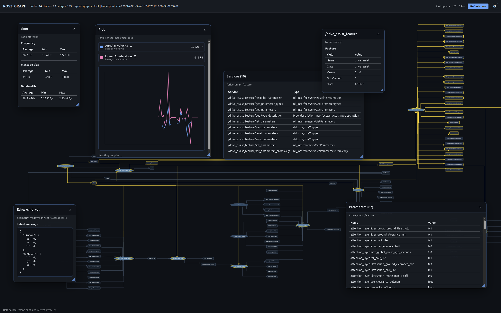

### Canvas Basics

- **Pan** – Click-and-drag anywhere that isn’t labelled to move the viewport.
- **Zoom** – Use the mouse wheel or trackpad scroll. The view zooms around the cursor.
- **Select** – Left-click a node or topic edge to highlight it. Selections persist so you
  can compare relationships.
- **Hover hints** – Move the mouse over nodes or edges to preview connections; the status
  banner summarises the focused element.
- **Context menu** – Right-click nodes or topics for actions (Info, Stats, Echo,
  Services, Parameters). The menu anchors to your pointer.

### Node & Topic Overlays
### Floating Overlays

- You can open multiple overlays at once;
- Drag the title bar to reposition an overlay anywhere on the canvas. Press `Esc` to close the active overlay stack.
- Use the corner handle (small blue triangle, bottom right) to resize overlays. The width and height persist while the overlay stays open, so long message payloads are easier to read.
- Click the × button in the title bar to close just that overlay.


**Info (nodes/topics)** – Shows namespaces, endpoint counts, and recent metadata in a
  floating card. The overlay tracks the node even if you pan the view.
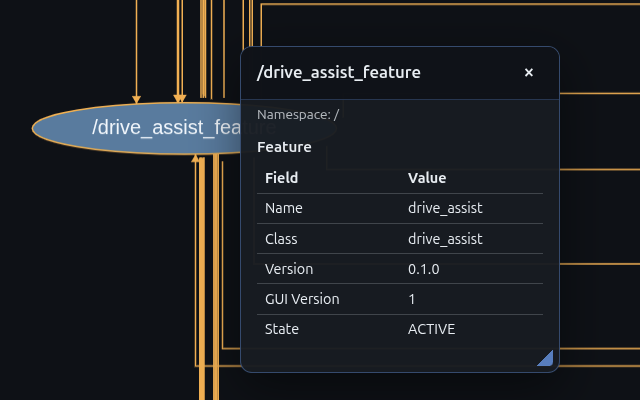

**Topic Stats** – The UI requests a short-lived probe that subscribes for ~2.5 seconds
  and returns message frequency and bandwidth estimates. Results are cached on the server
  side to avoid redundant sampling.
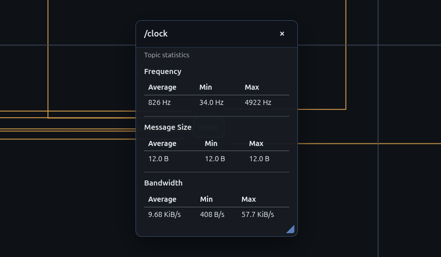

### Settings Menu

Click the gear button in the header to open the full-screen settings overlay. The **General**
tab lets you tune how aggressively the app refreshes data: set the graph polling period,
select the graph layout source (auto, ROS tooling/rqt-style, or built-in simple),
decide whether topic echoes/plots update on every new snapshot, and provide fallback
intervals (250–10 000 ms) when automatic streaming is disabled. The **Theme** tab switches
between light, dark, and a fully custom palette. Custom mode exposes color pickers for the
canvas, overlays, nodes, topics, and edges, plus a base scheme selector; changes apply
instantly and are persisted in `localStorage` so your palette is reused on the next visit.
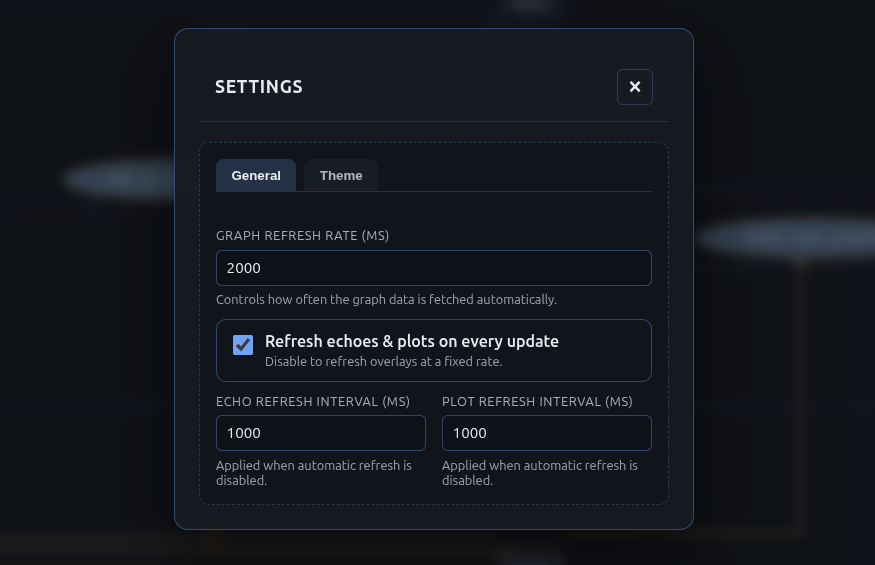


### Topic Plotting

Right-click a topic bubble/edge and choose **Plot** to launch the topic plotter. The UI
introspects the topic schema + a live sample, filters for numeric fields, and presents a
selector where you can pick up to four values (across nested paths) to chart. After you hit
**Plot**, a dedicated overlay starts streaming the topic, rendering the last 60 seconds of
data (capped at ~480 points) with per-series colors, legends, and min/max readouts. Excluded
message types (e.g., images/point clouds) are skipped automatically. Plot refresh cadence
is driven by the settings menu: when “Refresh echoes & plots on every update” is enabled the
chart updates whenever a new graph snapshot arrives, otherwise it follows the custom plot
interval you configured.
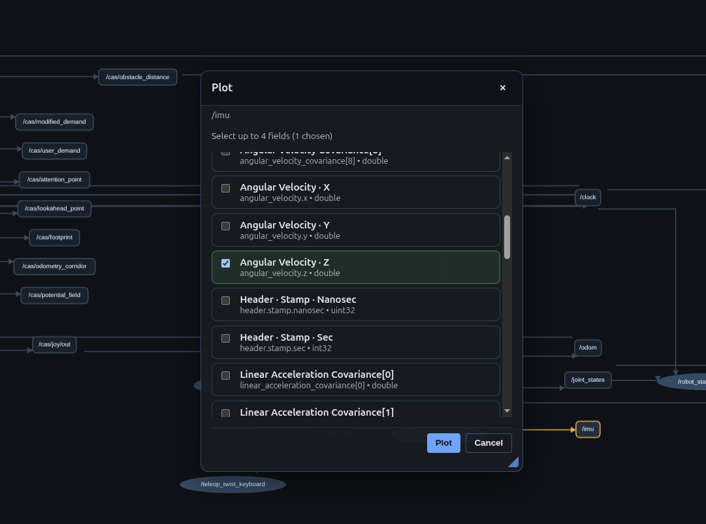
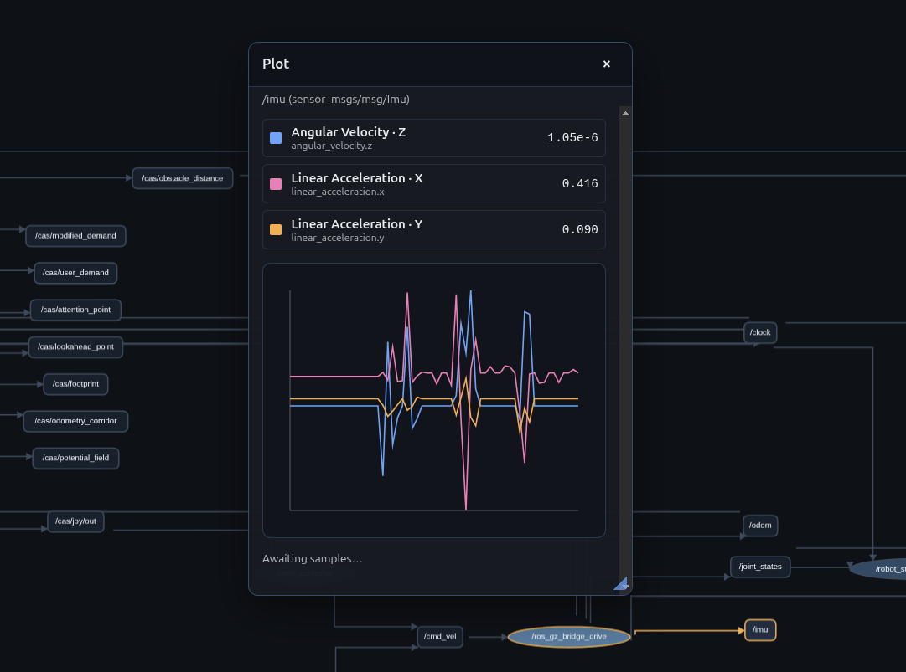


### Topic Echo
1. Right-click a topic edge or topic bubble → **Echo**.
2. The server creates a lightweight subscriber dedicated to that topic (the helper node is
   hidden from the visual graph).
3. A live overlay shows the most recent message header (stamp, frame id, etc.) and the
   `data` field, updating every few hundred milliseconds as new messages arrive.
4. Click elsewhere or press `Esc` to stop streaming; the subscriber is torn down
   immediately to avoid lingering traffic.

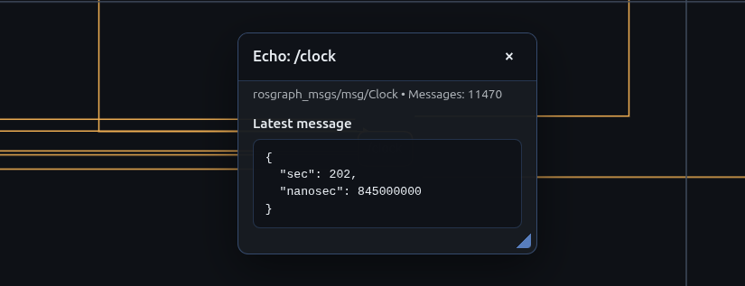

### Parameter Editor
1. Right-click a node → **Parameters**.
2. A table lists every declared parameter (name, value, type).
3. **Single-click** any value to open the parameter editor.
   - The modal pulls `DescribeParameters` so types, constraints, and descriptions are
     displayed.
   - Inputs are tailored to the type (booleans become toggles, numbers use numeric
     fields, arrays expect JSON).
4. Submit to call `set_parameter`. Success triggers an immediate refresh so you can see
   the new value reflected in the table.

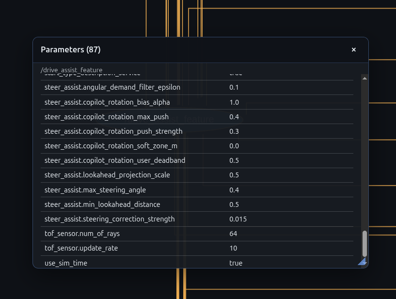
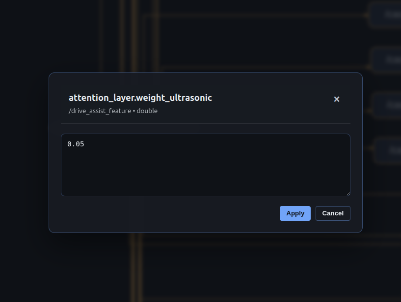

### Service Caller
1. Right-click a node → **Services**.
2. Click a service row to open the service caller modal.
   - The backend introspects the service type (`rosidl_parser` + `rosidl_runtime_py`)
     and sends a schema that the UI turns into nested form fields.
   - Arrays accept JSON. Complex sub-messages expand into grouped sections with their
     own inputs.
   - The modal shows an example request (when available) and caches the most recent
     response for reference.
3. Hit **Call** to invoke the service. The response is rendered as pretty-printed JSON.

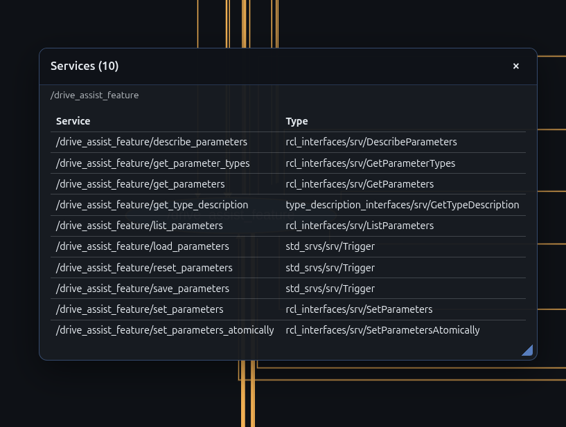
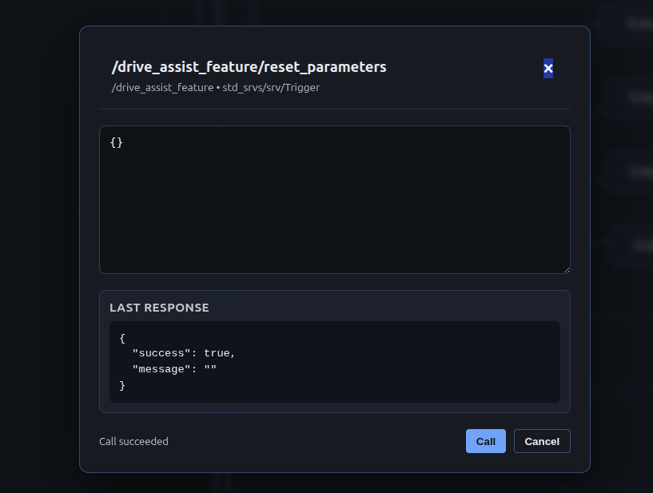

### Status & keyboard shortcuts

- Status messages (beneath the header) explain what the UI is doing: fetching schemas,
  applying updates, reporting errors, etc.
- `Esc` closes open overlays or the context menu.

---

## Server ↔ Front-End Contract

The web server lives in `ros2graph_explorer/web/server.py`. It exposes a small REST surface that
the bundled UI consumes, and you can reuse the same endpoints from your own client.

### 1. Graph Snapshots

`GET /graph[?layout=auto|rqt|simple]`

Returns the latest graph snapshot. Example:

```json
{
  "fingerprint": "a1f72f...",
  "generated_at": 1700000000.123,
  "graph": {
    "nodes": ["/talker", "/listener"],
    "topics": {
      "/chatter": ["std_msgs/msg/String"]
    },
    "edges": [
      {"start": "/talker", "end": "/chatter", "qos": "RELIABLE/TRANSIENT_LOCAL"},
      {"start": "/chatter", "end": "/listener", "qos": "RELIABLE/TRANSIENT_LOCAL"}
    ]
  },
  "graphviz": {
    "engine": "dot",
    "source": "rqt",                      // optional: actual layout source used
    "requested": "rqt",                   // optional: requested mode
    "plain": "graph 1 2 1 ...",            // optional plain-text layout dump
    "ids": {"nodes": {"talker": "n0", "listener": "n1"}} // optional mapping
  }
}
```

### 2. Topic Tools

`GET /topic_tool?action=<info|stats>&topic=/name[&peer=/node]`

| Action | Response |
| ------ | -------- |
| `info` | `{"action":"info","topic":"/chatter","data":{"topic":"/chatter","types":["std_msgs/msg/String"],"publishers":[{"name":"/talker","qos":["RELIABLE"]}], "subscribers":[...]}}` |
| `stats` | `{"action":"stats","topic":"/chatter","duration":2.5,"message_count":42,"average_hz":16.8,"average_bps":5120,"max_bytes":512,"cached":false}` |
| `echo` | Streaming interface, see below for modes and payload format. |

Errors use standard HTTP codes with an `{"error": "message"}` body. Topic statistics
require `rosidl_runtime_py` to introspect message types.

For `action=echo` the server exposes a lightweight streaming protocol:

- **Start** – `GET /topic_tool?action=echo&topic=/foo&mode=start` returns a unique
  `stream_id`. The response includes the topic type, message count so far, and the most
  recent sample (if any).
- **Poll** – Re-use the identifier with
  `GET /topic_tool?action=echo&topic=/foo&mode=poll&stream=<id>` to receive incremental
  updates. Poll as frequently as you need—the server throttles the updates to the most
  recent message.
- **Stop** – `GET /topic_tool?action=echo&topic=/foo&mode=stop&stream=<id>` releases the
  subscriber. Idle streams are also garbage-collected automatically after ~30 seconds of
  inactivity.

Example payload:

```json
{
  "action": "echo",
  "topic": "/chatter",
  "stream_id": "echo-17f2a-3",
  "type": "std_msgs/msg/String",
  "count": 12,
  "sample": {
    "header": {"stamp": {"sec": 1700000000, "nanosec": 123456789}, "frame_id": ""},
    "data": "hello world",
    "data_text": "hello world",
    "received_at": 1700000123.456789,
    "received_iso": "2024-11-03 12:35:23"
  },
  "timeout": 30.0
}
```

The `sample.data_text` field is a truncated, single-line representation that is safe to
display in constrained UIs, while `sample.data` preserves the full primitive/array/map
structure for programmatic consumption.

### 3. Node Tools

All node tool requests include the node fully-qualified name (`node=/my_node`). Depending
on the action you either use `GET` (for listings) or `POST` with a JSON body.

#### Read-only actions (`GET /node_tool`)

- `action=services` → `{"services":[{"name":"/my_node/reset","types":["std_srvs/srv/Empty"]}], ...}`
- `action=parameters` → `{"parameters":[{"name":"/foo","type":"integer","type_id":2,"value":"42","raw_value":"42"}], ...}`

#### Introspection actions (`POST /node_tool`)

```jsonc
// Describe parameter
{
  "action": "describe_parameter",
  "node": "/camera",
  "name": "exposure"
}
→ {
  "parameter": {
    "name": "exposure",
    "type": "double",
    "type_id": 3,
    "descriptor": {
      "description": "Exposure time in milliseconds",
      "read_only": false,
      "floating_point_ranges": [{"from_value": 0.0, "to_value": 33.0, "step": 0.1}]
    }
  }
}

// Describe service
{
  "action": "describe_service",
  "node": "/camera",
  "service": "/camera/set_info",
  "type": "sensor_msgs/srv/SetCameraInfo"   // optional hint
}
→ {
  "service": {
    "name": "/camera/set_info",
    "type": "sensor_msgs/srv/SetCameraInfo",
    "types": ["sensor_msgs/srv/SetCameraInfo"],
    "request": {
      "fields": [
        {"name":"camera_info","type":"sensor_msgs/msg/CameraInfo","is_array":false,"children":[...]},
        ...
      ],
      "example": {"camera_info": {...}}
    }
  }
}
```

Field descriptors mirror ROSIDL introspection:

| Key | Meaning |
| --- | ------- |
| `name` | Slot name. |
| `type` | Human-readable type string (supports nested sequences/arrays). |
| `is_array` | `true` if the field is a fixed-size array or sequence. |
| `array_size` / `max_size` | Bounds for arrays/sequences. |
| `element_type` | Element type for arrays. |
| `children` | Nested field descriptors for sub-messages. |
| `default` | Default value taken from the default-constructed message. |

#### State-changing actions (`POST /node_tool`)

- **Set parameter**  
  Body: `{"action":"set_parameter","node":"/camera","name":"exposure","type_id":3,"value":"12.5"}`  
  Response: updated parameter echo or error.

- **Call service**  
  Body: `{"action":"call_service","node":"/camera","service":"/camera/set_info","request":{...}}`  
  Response:  
  `{"service":{"name":"/camera/set_info","type":"sensor_msgs/srv/SetCameraInfo"},"request":{...},"response":{...},"response_text":"{\\n  ...\\n}"}`.

All responses use JSON; on failure you'll get an HTTP error code with an `error` field.

---

## Configuration Reference

| Parameter | Default | Description |
| --------- | ------- | ----------- |
| `output_format` | `dot` | Format printed to stdout (`dot`, `json`, `adjacency`). |
| `update_interval` | `2.0` | Seconds between graph samples (≥ 0.1). |
| `print_once` | `false` | Exit after publishing the first snapshot. |
| `web_enable` | `true` | Start the embedded HTTP server and web UI. |
| `web_host` | `0.0.0.0` | Host interface for the server. |
| `web_port` | `8734` | HTTP port. |
| `parameter_service_timeout` | `5.0` | Timeout (seconds) for parameter/service RPCs. |

---

## Extending & Contributing

- **Alternate clients** – Reuse the documented `/graph`, `/topic_tool`, and `/node_tool`
  endpoints to build CLI wrappers or custom dashboards.
- **Custom overlays** – The front-end is plain JavaScript; feel free to fork
  `app.js` to add annotations, change styling, or integrate authentication.
- **Server hooks** – New data can be threaded through `GraphSnapshot` and emitted via
  `/graph` with minimal changes. The JSON contract is intentionally straightforward.

Feel free to open issues or PRs with feature ideas, bug reports, or integration notes.
